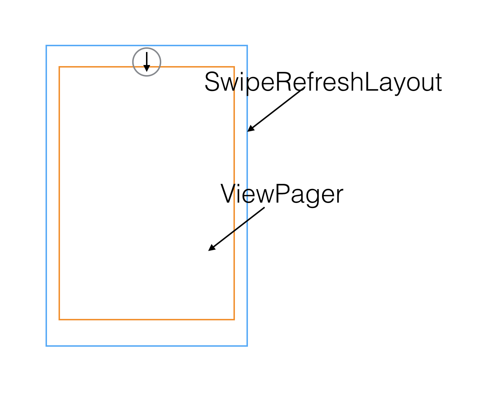

### 在一些场景中我们用到了SwipRefreshLayout下拉刷新，然后在SwipRefreshLayout中使用ViewPager，但是这样却并不能让我们同时使用下拉刷新和Viewpager的左右滑动，因为这两个空间存在滑动事件冲突，那么我们该怎么解决呢，下面一步一步分析。

#### 1.滑动事件传递

> 因为SwipRefreshLayout处于最底部，而ViewPager在最上层，当我们手点下是触发的是最先触摸到的View，所有我们一开始ViewPager消费了点击事件，然后为什么`SwipRefreshLayout`还是被触发了呢？下面我们继续查看他们两个分别的内部事件传递是怎么做的。

>1.`ViewPager`事件传递
当我们手按下时首先触发的是`ViewPager`的

>
>2.`SwipeRefreshLayout`事件传递