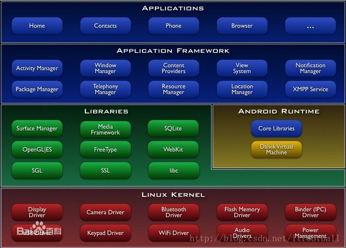
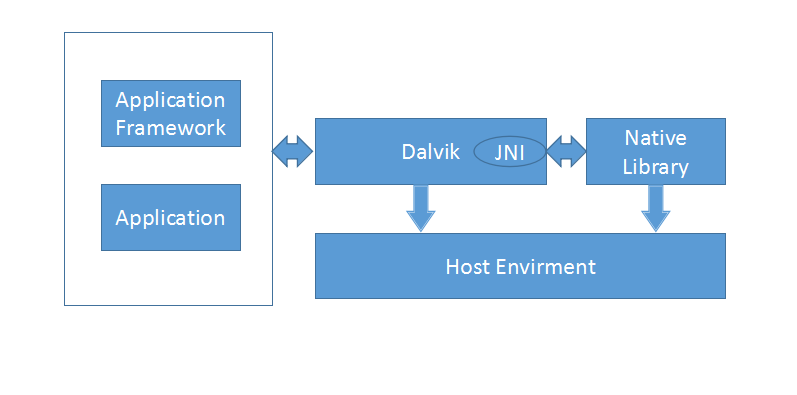

## Android 的设计与实现

## 第1章 Android体系结构与源代码阅读环境搭建

### 1.2 Android体系结构

1. 应用层

	* 应用层位于Android体系结构的最上层。Google在Android中内置了一些核心应用程序，例如主屏幕，联系人，电话等

2. 应用框架层

	* 为应用层提供API，提供了可以复用的组件，提供了应用层开发的规范，屏蔽了应用层与底层交互的复杂性。

	* 例如Content Provider,Activity Manager,Notification Manager等。

3. Android运行环境和系统运行库层

	* 第三层

	* 分成，系统运行库和Android运行环境

		系统运行库:

		|组件名称|功能描述|
		|---|---|
		|libc(bionic) |此处的libc库并不是GNU的标准libc库，而是Google开发的基于BSD许可的饿bionic库，在体积，运行效率，线程实现等方面做了优化 | 
		|WebKit|开源浏览器引擎 | 
		|Media FrameWork |多媒体框架，Android 2.3 之前采用PacketVideo 的OpenCore，自2.3版开始引入Stagefright | 
		|SQLite |嵌入式数据库引擎 | 
		|OpenGL ES |3D图形渲染库，支持OpenGL ES 1.x和2.0规范 | 
		|FreeType |位图和矢量字体渲染引擎 | 
		|SurfaceManager |渲染管理器，显示系统的核心组件组成部分，负责绘图的合成管理 | 
		|SGL |基于Skia的2D图形渲染引擎 | 
		|SSL |网络通信安全协议 | 

		Android运行环境的主要组件:

		|组件名称|功能描述| 
		|---|---|
		|Core Libraries |是对标准JAVA和核心库的裁剪，保留标准JAVA API 的多数功能，并加入了Android特有的API，比如android.os包下的API | 
		|Dalvik Virtual Machine（DVM）） |主要完成应用程序进程管理，堆栈管理，对象生命周期管理，安全和异常检查，垃圾回收等功能，Google并没有采用标准的JVM虚拟机，而是采用针对嵌入式设备内存，供电，处理速度有限的情况开发的Dalvik虚拟机，该虚拟机有以下主要优点：* 基于寄存器。可以针对特定的硬件最大化优化代码 * 运行的是经过优化和压缩的DEX字节码。DEX字节码比JAR字节码节省几乎一半的空间，提高I/O读取速度。而且可以进一步优化为ODEX字节码* 进程安全和隔离。允许在优先的内存中同时运行多个虚拟机，每一个Android应用都运行在自己的DVM实例中，都有自己独立的进程空间。DVM依赖Linux的信啊成调度和管理机制，通过fork函数为每个应用程序创建一个Linux进程。所有的Android应用程序在底层都对应自己的Linux进程。不同的应用程序在不同的进程空间内运行，独立的进程空间可以防止在DVM崩溃是所有程序都被"杀死" |

4. Linux内核层

	* 基于Linux3.0

	* 充分利用了Linux内核权限的安全模型，内存管理，进程管理，网络协议栈和驱动模型

	* 不同与Linux之处：

		* 弃用了标准Linux的GUI系统

		* 采用更有效率的Bionic Libc库代替glibc库

		* 基于ARM架构增加了Gold-Fish平台

		* 专有的驱动程序：Binder，Logger，PowerManager，Timed GPIO，Alarm，Ashmem，RAM Console。

	* 应用层和frameworks

		* 应用层：特指Android四层体系架构中的Application Framework，应用层不仅为应用提工了api和UI控件，而且为应用提供了一套代码设计的模式。引入应用框架后，应用层被浓缩为Activity，Service，Content Provider和Broadcast Receiver。

		* 框架层：把应用框架层，Android运行环境和系统运行库以及Binder都贵与框架层。

		* frameworks：一般指Android源码中的frameworks包。

## 第2章 框架基础JNI

### 2.1 JNI在Android系统中所处的位置

* Android采用分层的体系结构，上层应用层和应用框架层主要使用了Java语言开发，下册则运行一个Linux内核，并在内核之上集成了各种核心库和第三方库，连接部分就是jni

* NDK与JNI的区别：NDK是为便于开发基于JNI的应用而提供的一套开发和编译工具；而JNI则是一套变成接口，可以运行在应用层，也可以运用在应用层架构层，以实现加吧代码与本地代码的互操作。

* 

## 第7章 线程消息通信与异步处理

### 7.1 什么事Looper线程

* run方法执行后不会立即退出，而是进入一个loop消息循环中等待消息的到来。

* 

