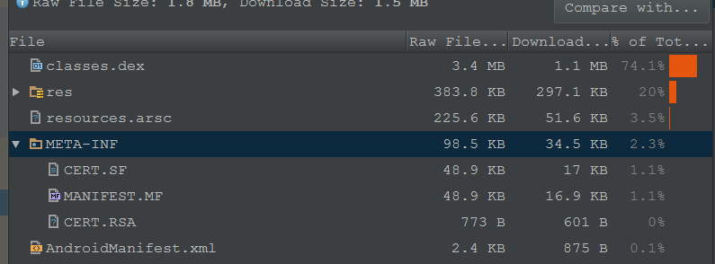
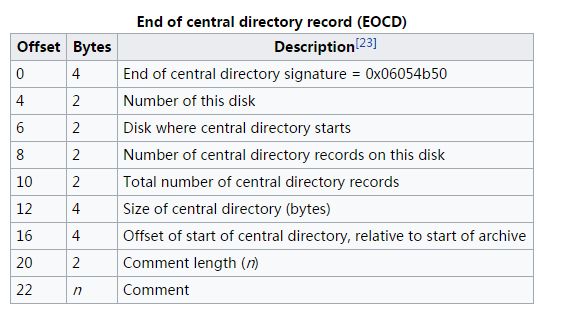

## V2 Signature打包方案

### 使用V2的原因

Android 7.0（Nougat）引入一项新的应用签名方案APK Signature Scheme v2，它是一个对全文件进行签名的方案，能提供更快的应用安装时间、对未授权APK文件的更改提供更多保护.

[v2 signature 官方解释](https://source.android.com/security/apksigning/v2)

同时V2方案对V1方案做了很好的兼容处理（Apk中同时存在v1,v2签名）。

### V1签名

只是校验了apk资源，并没有约束zip,签名信息存储在zip/META-INF中。

### V2 Signature详解

* V2原理

	使用APK V2签名将在APK中心目录部分之前插入一个APK签名块到APK文件。在APK签名块内，v2签名和签名者身份信息存储在APK Signing Block中。

	那么整个APK（ZIP文件格式）会被分为以下四个区块：

		1. Contents of ZIP entries（from offset 0 until the start of APK Signing Block）
		2. APK Signing Block
		3. ZIP Central Directory
		4. ZIP End of Central Directory

	

	1,3,4是ZIP文件格式,详细的ZIP格式可看：[ZIP file_format](https://en.wikipedia.org/wiki/Zip_\(file_format\))

* APK签名块(APK Signing Block)

	为了保持与当前APK格式的向后兼容性，v2和APK签名存储在APK Signing Block内，这是一个新的容器，用于支持V2签名方案。在APK文件中，APK Signing Block位于` Contents of ZIP entries`末尾和ZIP`Central Directory`之前。

	该块包含ID值对，这种方式使得APK更容易找到该块，APK的v2签名存储在ID为0x7109871a的键值对中。

* APK Signing Block 格式（所有数字字段都是little-endian）：

    * size of block 以字节（不包括此字段）（uint64）,也就是 APK Signing Block 实际长度为+8

	* uint64长度前缀ID值对的序列：
		* ID （UINT32）
		* value （可变长度：内部键值对的长度 - 4个字节）
	* size of block 以字节为单位，与第一个字段（uint64）相同
	* magic “APK Sig Block 42”（16 bytes）

	我们重点来看一下这个ID-value，它由一个8字节的长度标示＋4字节的ID＋它的负载组成。V2的签名信息是以ID（0x7109871a）的ID-value来保存在这个区块中，不知大家有没有注意这是一组ID-value，也就是说它是可以有若干个这样的ID-value来组成

	|Offset|Bytes|Description|
	|:------|:------|:------|
	|0 |8 |Apk Signing Block 大小，但是不包含本身，也就是实际Block大小需要+8 |
	|8 |8 |键值对的起始标记，存储键值对的大小，也就是后面pair的，key+value 占用的byte  |
	|16|4+n|key 为 4byte,value 为变化的 |
	|@+16|8 |Apk Signing Block同上 |
	|@+24|16 |magic “APK Sig Block 42” |

* 如何找到 APK Signing Block 

    首先通过ZIP `End of Central Directory`中存储的信息找出ZIP `Central Directory`数据偏移量，然后就可以找到APK Signing Block的位置。
    与此同时存在magic的值为`APK Sig Block 42`也就表示APK Signing Block的结尾，剩下的通过`size of block`可以找出APK Signing Block的起始位置。

	`End of Central Directory` 格式如下：

	

* 提醒

	Android系统在解释APK Signing Block时，忽略未知ID的键值对。

* 签名后的APK完整性验证

	

	被保护的部分包括1,3,4,这三个部分不能修，但是EOCD中`offset of start of central directory,relative to start of archive`可以修改。

### 得到的有用信息

1. APK Signing Block 是可变的

2. APK Signing Block是通过已知键值对方式存储，未知ID Android系统将不做处理。

3. 只需要生成一个基础包，加入渠道信息不用重新打包

### APP渠道如何写入

如果一次需要打100渠道包，使用flover是一件烦人的事情，速度非常慢，有没有更快的方式呢？

V1: setComment 和 META-INF 中写入Channel信息，能解决这个问题，并且速度非常快。

V2：V1的方式不可行，因为签名范围扩大到整个zip，改动后会导致apk无法安装，所以只能通过新方式写入。

### 实现方案

[AndroidV2SignatureChannelTool](https://github.com/goodbranch/AndroidV2SignatureChannelTool)

测试中为了排除打第一个包的干扰，先生成release包，然后再通过命令生成渠道包。

结果：52s/100

因为文件写入操作比较稳定，基本可以代表整体数据。

#### 参考文献

[apksig源码](https://android.googlesource.com/platform/tools/apksig/)

[v2 signature 官方解释](https://source.android.com/security/apksigning/v2)

