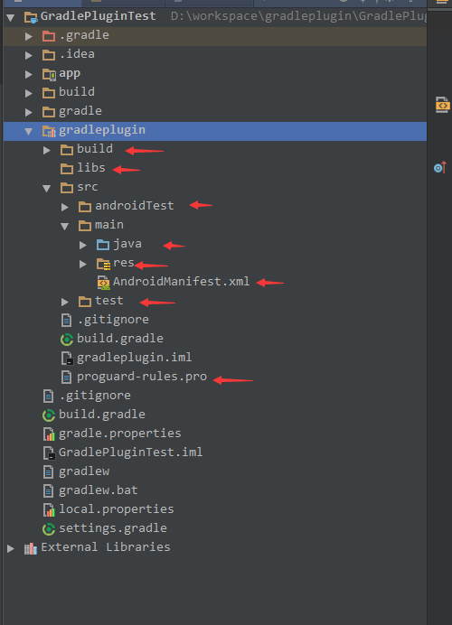
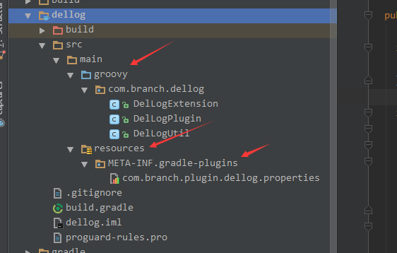
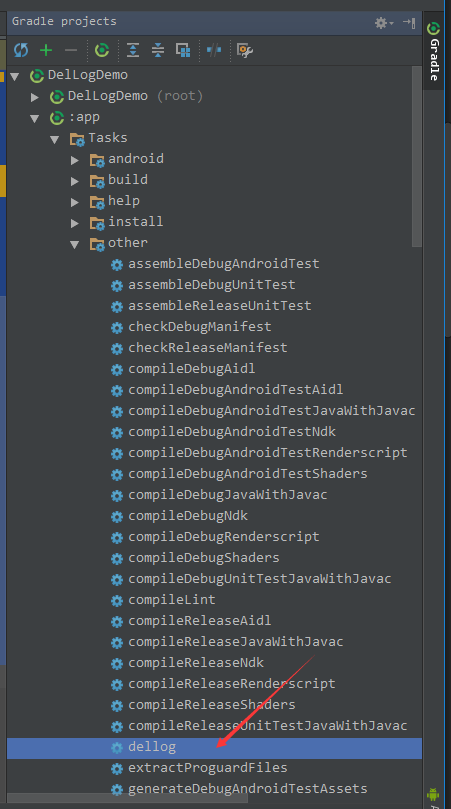
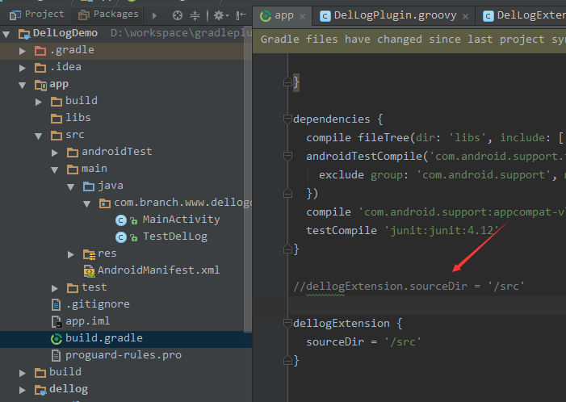
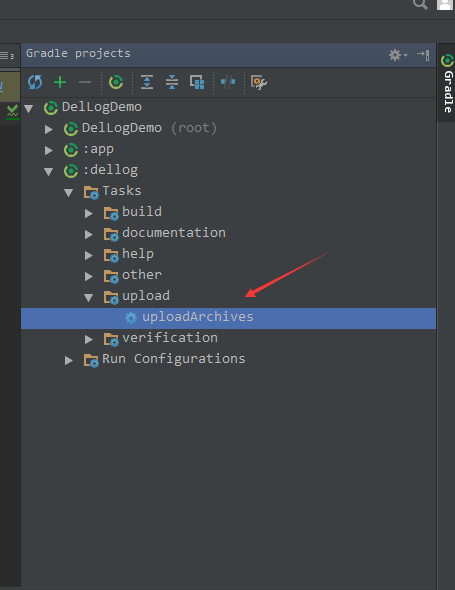
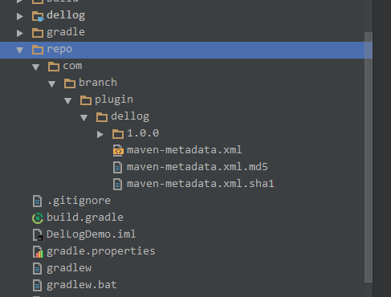

## Android Gradle Plugin 

### Android Gradle Plugin 有两种形式

> 1. 直接在build.gradle/创建x.gradle中开发

> 2. 实现`Plugin`重写build 过程

这里讲解怎么开发自定义插件

### 首先创建Gradle Plugin 工程

* 为了方便测试先创建一个Android 工程，然后创建一个Android library Module工程

* 删除如图中箭头所指目录和文件

* `build.gradle`中改成groovy方式

		apply plugin: 'groovy'

		dependencies {
		    compile gradleApi()
		    compile localGroovy()
		}

### 自定义Gradle Plugin，在main目录下创建groovy目录，这个目录下创建创建自己的代码

#### 以删除log日志为例

#### 1.继承 gradle`Plugin`，类的后缀不再是.java而是.groovy

	class DelLogPlugin implements Plugin<Project> {
	  @Override
	  void apply(Project project) {

	    project.extensions.create('dellogExtension', DelLogExtension);

	    project.afterEvaluate {
	      //在gradle 构建完之后执行
	      project.logger.error("dellogExtension : " + project.dellogExtension.sourceDir);

	      def rootDir = project.projectDir.toString().plus(project.dellogExtension.sourceDir);

	      project.logger.error(rootDir);

	      DelLogUtil.delLog(new File(rootDir));
	    }

	    project.task('dellog', {
	      project.logger.error("dellogExtension : " + project.dellogExtension.sourceDir);

	      def rootDir = project.projectDir.toString().plus(project.dellogExtension.sourceDir);

	      project.logger.error(rootDir);

	      DelLogUtil.delLog(new File(rootDir));

	    })

	  }
	}

`afterEvaluate`是在gradle构建完后自动执行的，但task需要手动执行
一个插件中可以创建多个Task,如代码中的`dellog`，可以在控制台执行`gradle -q dellog`，也可以在gradle图形界面执行

#### 2. 创建可以输入的Gradle 插件

> 很多时候我们需要输入参数，然后根据参数来做处理,处理如下：
project.extensions.create(...,...); 前面是Name，后面是Model,model中在gralde script 中键对上就可以。

	class DelLogExtension {

	  String sourceDir;

	}

	class DelLogPlugin implements Plugin<Project> {
	  @Override
	  void apply(Project project) {

	    project.extensions.create('dellogExtension', DelLogExtension);

	    ......

然后在app 下的build.gradle中

	dellogExtension.sourceDir = '/src'

或

	dellogExtension {
	  sourceDir = '/src'
	}

### 3. 在main下创建`resources`目录

`src/main/resources/META-INF/gradle-plugins/com.branch.plugin.dellog.properties`

`xxx.properties` 将来作为apply plugin: xxx 插件名称，这里的目录结构不能错，先有`META-INF`再有`gradle-plugins`

内容：

	`implementation-class=com.branch.dellog.DelLogPlugin(继承Plugin的类，插件的入口类)`

### 4. 发布到本地仓库

在当前lib项目build.gradle中增加maven支持

	apply plugin: 'maven'

	repositories {
	  mavenCentral()
	}

然后增加对应的maven deployer

	//设置maven deployer
	uploadArchives {
	  repositories {
	    mavenDeployer {
	      //设置插件的GAV参数
	      pom.groupId = 'com.branch.plugin'
	      pom.artifactId = 'dellog'
	      pom.version = '1.0.0'
	      //文件发布到下面目录
	      repository(url: uri('../repo'))
	    }
	  }
	}

这里设置发布到上一个目录的`repo`中,同时可以查看gradle task中有一个名为uploadArchives的task

执行就能在`repo`中查看到相应jar包

### 5. 使用本地仓库

在project 的build.gradle 中`buildscript`中增加本地仓库地址

	buildscript {
	  repositories {
	    jcenter()
	    maven {
	      url uri("/repo")
	    }
	  }
	  dependencies {
	    classpath 'com.android.tools.build:gradle:2.2.2'
	    classpath 'com.branch.plugin:dellog:1.0.0'

	    // NOTE: Do not place your application dependencies here; they belong
	    // in the individual module build.gradle files
	  }
	}

然后在app 的build.gradle中增加plugin

	apply plugin: 'com.branch.plugin.dellog'

#### 所有这些配置正确后同步项目可在Gradle Console查看到日志
