## Gradle Build Files in Android 第一章

### Gradle for Android Basics

Android applications 使用gradle构建，gradle是一门高级语言并且广泛用于java中，提供的Android插件为Android apps开发提供了很多的功能，例如build types, flavors, signing configurations, library projects，更多可查看[Android Plugin DSL Reference](http://google.github.io/android-gradle-dsl/current/index.html)

#### 1.1 Gradle Build Files in Android

**问题**

你想理解创建Android工程生成的build file

**解决方案**

创建一个新的Android工程并查看`settings.gradle`, `build.gradle`, 和 `app/build.gradle`.

**分析**

Android Studio 是官方提供开发Android projects 的IDE，通过Android Studio 向导`Start a new Android Studio project`创建第一个项目吧。

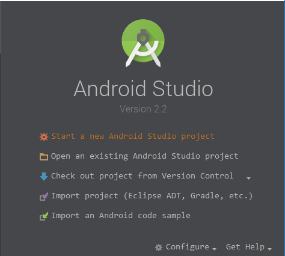

这一步就不多说了，相信大家都知道的。

然后我们看到一个默认的工程是怎么样的。

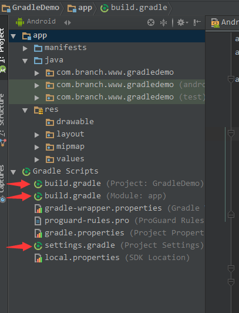

**settings.gradle**

Gradle 构建的Android工程是一个多项目工程，在`settings.gradle`中显示当前项目有哪些module。默认显示：

		include ':app'

如果这时我创建一个名为`gradledemomodule` 的library项目

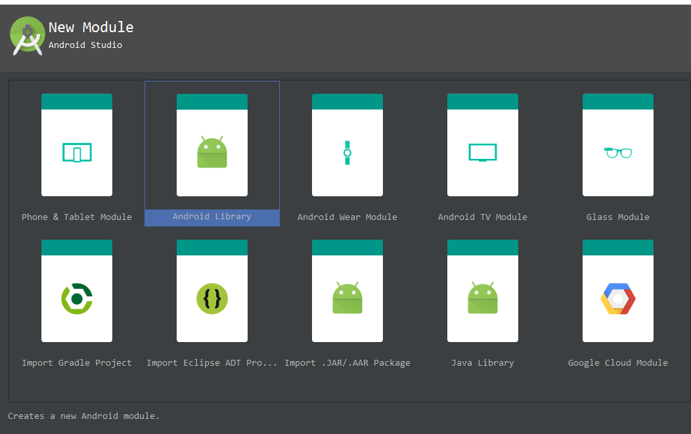

则`settings.gradle`会增加`gradledemomodule`，多个项目用,隔开，显示如下：

		include ':app', ':gradledemomodule'

**project的build.gradle**

		buildscript {
		  repositories {
		    jcenter()
		  }
		  dependencies {
		    classpath 'com.android.tools.build:gradle:2.1.0'

		    // NOTE: Do not place your application dependencies here; they belong
		    // in the individual module build.gradle files
		  }
		}

		allprojects {
		  repositories {
		    jcenter()
		  }
		}

		task clean(type: Delete) {
		  delete rootProject.buildDir
		}

首先来看下`buildscript`节点，他是gradle脚本自身需要使用的资源，资源下载来自`jcenter`仓库,关于`jcenter`和`Maven`单独去了解。`jcenter`目前是默认的，他兼容了`Maven`并且性能更优。然后在`dependencies`节点中声明了我们使用的gradle版本。

或许我们会以为`allprojects`中也同样声明了`jcenter`是否是重复了，其实不是的`allprojects`设置所有project默认的仓库来源，与`buildscript`作用范围是不一样的。

task clean声明了一个任务，任务类型是Delete(也可以是copy等)，每当修改`settings.gradle`后同步则会删除`rootProject.buildDir`目录下所有。

**app的build.gradle**

		apply plugin: 'com.android.application'

		android {
		  compileSdkVersion 24
		  buildToolsVersion "23.0.3"

		  defaultConfig {
		    applicationId "com.branch.www.gradledemo"
		    minSdkVersion 18
		    targetSdkVersion 24
		    versionCode 1
		    versionName "1.0"
		  }

		  buildTypes {
		    release {
		      minifyEnabled false
		      proguardFiles getDefaultProguardFile('proguard-android.txt'), 'proguard-rules.pro'
		    }
		  }
		}

		dependencies {
		  compile fileTree(dir: 'libs', include: ['*.jar'])
		  testCompile 'junit:junit:4.12'
		  compile 'com.android.support:appcompat-v7:24.1.1'
		}

这个目录下的build.gradle 是开发过程中最重要的，首先看到`apply plugin: 'com.android.application'`，他的作用是把Android插件加入到当前build工程，相应的插件功能可看上一个**DSL**。

`android`节点则是一些Android的配置，例如app 版本，编译sdk,包名，混淆配置，多渠道等。

`dependencies`节点是帮助我们添加项目依赖，并且通过上一个.gradle知道默认仓库是`jcenter`

#### 1.2 配置SDK版本以及其他

**问题**

你想要设置最低和目标Android SDK版本或者是否混淆，多渠道等。

**解决方法**

修改当前`build.gradle`中android节点中的配置。

**分析**

例如除了上面已经配置的我们还可以加入多渠道。在`android`节点内：

		 flavorDimensions 'attitude', 'client'

		  productFlavors {
		    arrogant {
		      dimension 'attitude'
		      applicationId 'com.oreilly.helloworld.arrg'
		    }
		    friendly {
		      dimension 'attitude'
		      applicationId 'com.oreilly.helloworld.frnd'
		    }
		    obsequious {
		      dimension 'attitude'
		      applicationId 'com.oreilly.helloworld.obsq'
		    }
		    stark {
		      dimension 'client'
		    }
		    wayne {
		      dimension 'client'
		    }
		  }

然后通过Generate Signed APK 可以选择多渠道，并且每个渠道都可以配置自己的信息，例如修改包名。

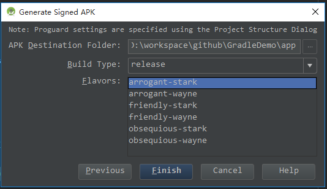

这里只是简单的介绍，后面在再更加详细分析。

#### 1.3 在控制台执行gradle build 
**问题**

你想通过命令run gradle tasks.

**解决方法**

在控制台运行它。

**分析**

你不需要为了build Android project 而去下载安装gradle ，因为项目中已经配置好了。直接在Android Studio的terminal中执行。

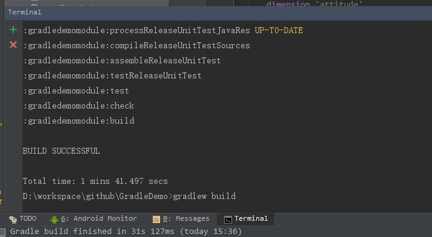

windows下输入`gradlew build`即可。

在控制台你可以运行任何gradle支持的task，包含自定义的task，输入`gradlew tasks`会列出项目中所有 task。这份报告显示项目中所有的默认 task 以及每个 task 的描述。

**额外的功能和控制台标记**

* 使用空格分开使一次run多个task。如：

			>gradlew lint hello

	`lint`是自带的，`hello`是我自己写的，这样就会执行lint后再执行hello.

	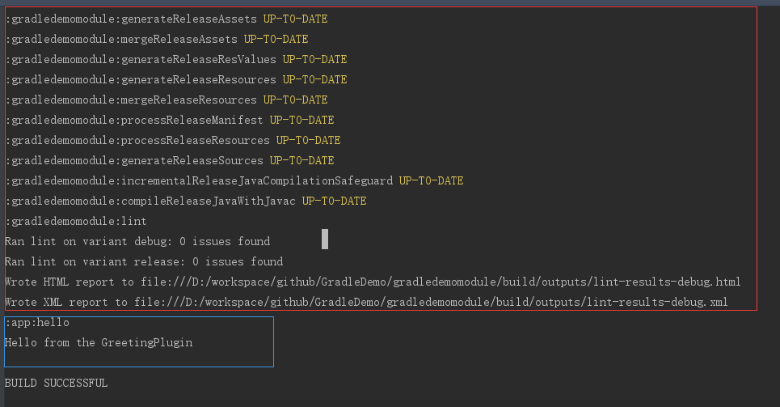

	同时你会发现相同名字的task在一次执行中只会执行**一遍**。

* 使用`-x`标记排除task

			>gradlew lint -x hello
    
    这一次执行只会执行lint而不会执行hello。

* 发生故障时继续构建 --continue

    默认情况下，只要任何 task 失败，Gradle 将中止执行。这使得构建更快地完成，但隐藏了其他可能发生的故障。为了发现在一个单一的构建中多个可能发生故障的地方，你可以使用 --continue 选项。

* 任务名称缩写

    例如我创建一个名为`greet`的task,在控制台输入`>gradlew g`也可以执行，也就当你试图执行某个 task 的时候,无需输入 task 的全名.只需提供足够的可以唯一区分出该 task 的字符即可

* 选择要执行的构建

    调用 gradle 命令时,默认情况下总是会在当前目录下寻找构建文件（译者注：首先会寻找当前目录下的 build.gradle 文件,以及根据settings.gradle 中的配置寻找子项目的 build.gradle ）。 可以使用 -b 参数选择其他的构建文件,并且当你使用此参数时 settings.gradle 将不会被使用,看下面的例子:

		    app/demo.gradle

				task demohello <<{

				println "hello demo gradle"
		    }

    在app目录下我又创建了一个`demo.gradle`,如果想要执行`demo.gradle`中的task可以使用`-b`，如：

			gradlew -b app/demo.gradle demohello

	如果不想使用`-b` 可以使用`apply`把`demo.gradle`加入到当前build.gradle

			apply plugin: 'com.android.application'
			   apply from: 'demo.gradle'

    如果这样配置后执行是直接使用task名。

* 显示 task 使用细节

    执行 `gradle help --task someTask` 可以获取到 task 的详细信息， 或者多项目构建中相同 task 名称的所有 task 的信息,如下

			Detailed task information for demohello
				                     
			Path                 
				 :app:demohello  
				                     
			Type                 
				 Task (org.gradle.api.Task)
				                     
			Description          
				 -               
				                     
			Group                
				 -               
				                     
		    BUILD SUCCESSFUL

#### 1.4 使用Android Studio执行Gradle Builds

**问题**

直接通过Android Studio 执行Gradle

**解决方法**

使用Gradle 视图去执行tasks

**分析**

Android Studio 本身是带有Gradle 视图列出所有tasks.

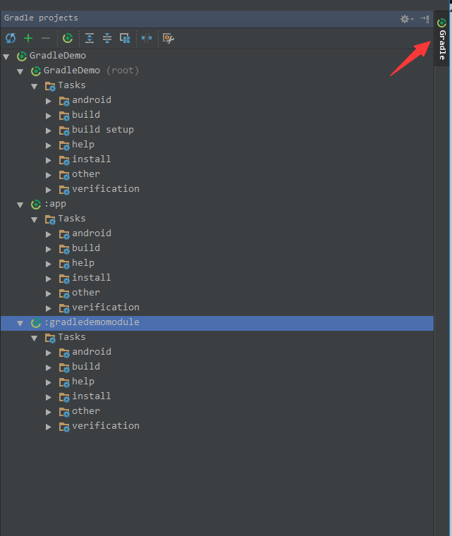

选择一个执行,双击或右键选择执行

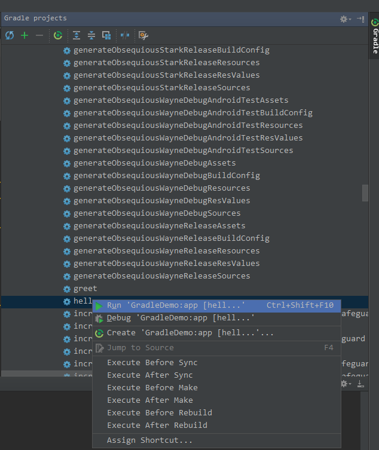

#### 1.5 添加java library

**问题**

添加java library 到项目中

**解决方法**

在`build.gradle`的`dependencies`添加

**分析**

默认的dependencies

			dependencies {
			  compile fileTree(dir: 'libs', include: ['*.jar'])
			  testCompile 'junit:junit:4.12'
			  compile 'com.android.support:appcompat-v7:24.1.1'
			}

* dependencies基本语法

    library依赖完全的语法是 group:name:version

    * 完全语法：

   			testCompile group: 'junit', name: 'junit', version: '4.12'

    * 简写语法：

    		testCompile 'junit:junit:4.12'

    * 版本为变量的写法(不推荐)：

    		testCompile 'junit:junit:4.+'

    	只要版本大于等于4.0的都可以。

	* jar包依赖：

			dependencies {
			compile files('libs/a.jar', 'libs/b.jar')
			compile fileTree(dir: 'libs', include: '*.jar')
			}

**Synchronizing the project**

每次更改.gradle后需要同步整个项目，通常IDE会在顶部提示：

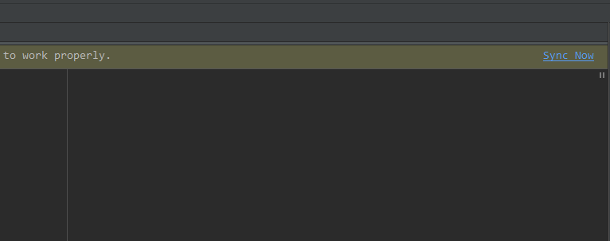

或

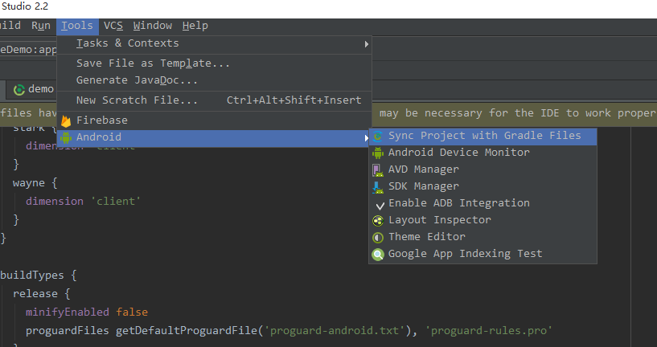

同步时会到仓库去下载依赖包。

**Transitive dependencies**

间接依赖是指在依赖的A中同时A又依赖了B，那么依赖就会同时下载A，B到项目中。
可在控制台执行`androidDependencies`task查看传递依赖。

传递依赖默认是允许的，可以通过`transitive`关闭，例如：

			dependencies {
			runtime group: 'com.squareup.retrofit2', name: 'retrofit', version: '2.0.1',
			transitive: false
			}

或，只需要groovy-all本身的jar包，不需要简介依赖的。

			dependencies {
			    compile 'org.codehaus.groovy:groovy-all:2.4.4@jar'
			}

或

			dependencies {
			    compile group: 'org.codehaus.groovy', name: 'groovy-all',
			       version: '2.4.4', ext: 'jar'
			}

如果是`aar`则把`@jar`

**Excluding dependencies**

如果一个library中有我们不需要的包，则可以通过`exclude`移除。

			androidTestCompile('com.android.support:appcompat-v7:24.1.1') {
			exclude group: 'support-vector-drawable'
			exclude group: 'animated-vector-drawable'
			}

#### 1.6 通过Android Studio 添加依赖包

**问题**

使用Android Studio添加依赖，而不是直接使用build.gradle

**解决方案**

在项目设置中的`Dependencies`选择依赖lib

**分析**

打开项目设置，选择`Dependencies`

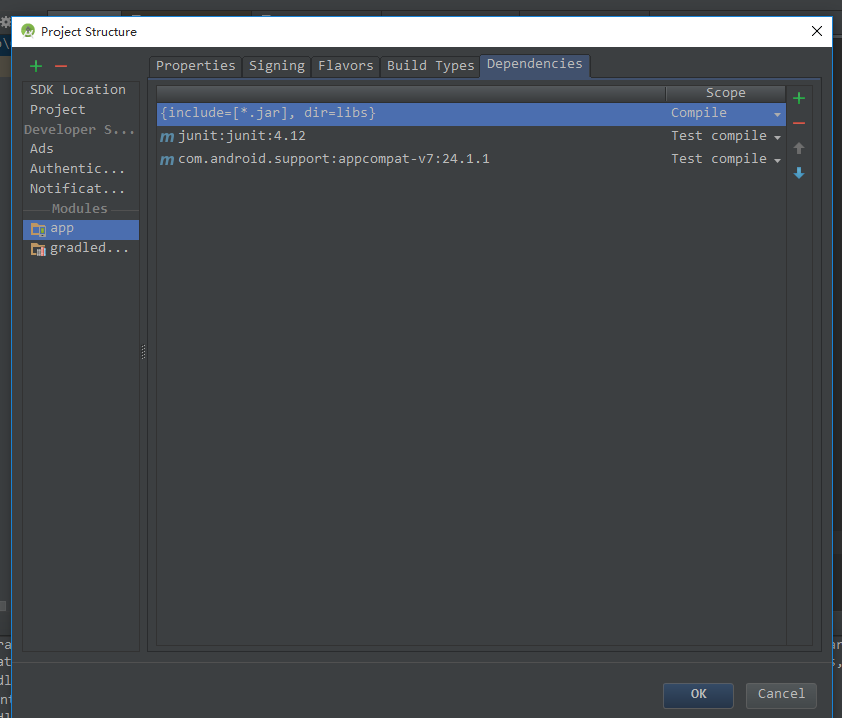

同时`Dependencies`提供了6中依赖作用范围：

* Compile

	compile是对所有的build type以及favlors都会参与编译并且打包到最终的apk文件中。

* Provided

	Provided是对所有的build type以及favlors只在编译时使用，类似eclipse中的external-libs,只参与编译，不打包到最终apk。

* APK

	只会打包到apk文件中，而不参与编译，所以不能再代码中直接调用jar中的类或方法，否则在编译时会报错

* Test compile

	Test compile 仅仅是针对单元测试代码的编译编译以及最终打包测试apk时有效，而对正常的debug或者release apk包不起作用。

* Debug compile

	Debug compile 仅仅针对debug模式的编译和最终的debug apk打包。

* Release compile

	Release compile 仅仅针对Release 模式的编译和最终的Release apk打包。

依赖的方式有三种，仓库依赖，文件依赖，module依赖。

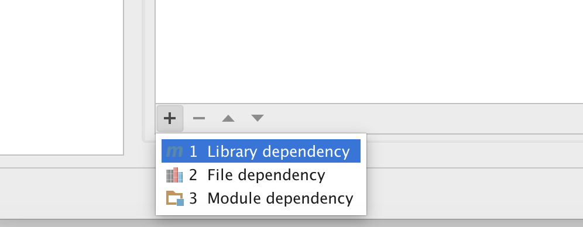

#### 1.7 Configuring Repositories

**问题**

你想要gradle 准确的实现任何library依赖。

**解决方法**

配置`repositories`节点

**分析**

* Declaring Repositories

    `repositories`中告诉gradle到哪里去找到依赖，通常我们都是使用`jcenter()`

			repositories {
			    jcenter()
			}

	jcenter 仓库在`https://jcenter.bintray.com/`

	同时我们也可以使用`maven` 地址：`http://repo1.maven.org/maven2`

			repositories {
			    mavenLocal()
			    mavenCentral()
			}
    
    maven 支持在本地发布仓库，然后使用。

    maven 也能通过url加载依赖。

		    repositories {
		    maven {
		        url 'http://repo.spring.io/milestone'
		    }
			}

	如果仓库有保护，可以使用username，password

			repositories {
		    maven {
		        credentials {
		            username 'username'
		            password 'password'
				}
		        url 'http://repo.mycompany.com/maven2'
		    	}
			}

	使用lvy 仓库

			repositories {
			    ivy {
			        url 'http://my.ivy.repo'
			    }
			}

    使用本地目录作为仓库

			repositories {
			    flatDir {
			dirs 'lib' }
			}