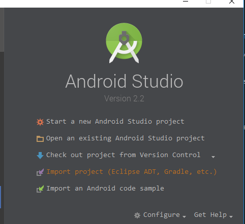
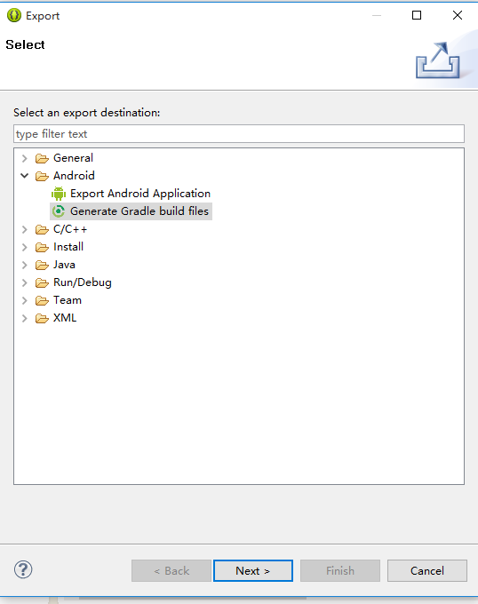
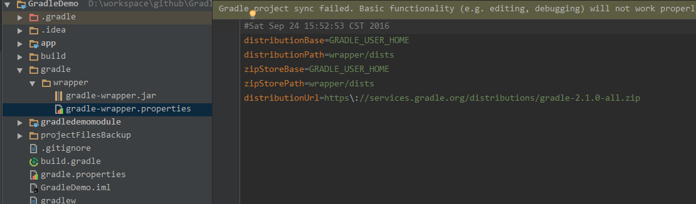
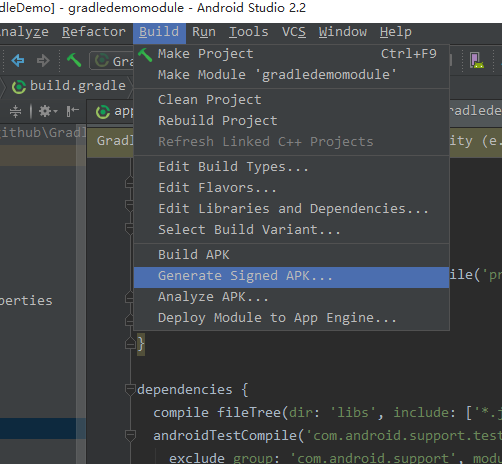

## Gradle Build Files in Android 第二章

### 从创建项目到发布

#### 2.1 Setting Project Properties

**问题**

如何通过`ext`节点把一些常量从`build.gradle`中移除加入到`gradle.properties`，或者在控制台`-p`设置值。

**解决方法**

* 在`build.gradle`中通过`ext`把例如版本号，版本名集中设置。

	例如：

		ext {
		  appcompat_version = '24.2.1'
		  versionCodes=13
		  versionNames='2.3'
		}

	使用：

		defaultConfig {
		   applicationId "com.branch.www.gradledemo"
		   minSdkVersion 18
		   targetSdkVersion 24
		   versionCode versionCodes
		   versionName versionNames
		}

	或

		compile("com.android.support:appcompat-v7:$appcompat_version")

* 使用gradle.properties

	例如在`gradle.properties`加入：

		login='user'
		pass='my_long_and_highly_complex_password'

	然后在`build.gradle`中使用

		repositories {
			maven {
			url 'http://repo.mycompany.com/maven2'
			credentials {
			username 'user'
			password 'password'
			}
		 }
		}

	或你可以在控制台使用`-P`输入`login`,'password'参数给properties设值。

		gradlew -Plogin=me -Ppassword=this_is_my_password assembleDebug

    
#### 2.2 转换Eclipse Android项目到Android Studio

**问题**

早期都是使用Eclipse开发，现在想要使用Android Studio。

**解决方法**

Android Studio自带导入向导，根据向导一步一步做。

#### 2.3 转换Eclipse Android项目到Android Studio通过Eclipse

**问题**

早期都是使用Eclipse开发，现在想要使用Android Studio。（推荐使用2.2方式）

**解决方法**

右键项目`Export`->`Generate Gradle build files`->选择这个项目下的所有library->finish

然后就会生成一个`build.gradle`

	apply plugin: 'android'

	dependencies {
	    compile fileTree(dir: 'libs', include: '*.jar')
	    compile project(':appcompat_v7')
	}

	android {
	    compileSdkVersion 24
	    buildToolsVersion "23.0.3"

	    sourceSets {
	        main {
	            manifest.srcFile 'AndroidManifest.xml'
	            java.srcDirs = ['src']
	            resources.srcDirs = ['src']
	            aidl.srcDirs = ['src']
	            renderscript.srcDirs = ['src']
	            res.srcDirs = ['res']
	            assets.srcDirs = ['assets']
	        }

	        // Move the tests to tests/java, tests/res, etc...
	        instrumentTest.setRoot('tests')

	        // Move the build types to build-types/<type>
	        // For instance, build-types/debug/java, build-types/debug/AndroidManifest.xml, ...
	        // This moves them out of them default location under src/<type>/... which would
	        // conflict with src/ being used by the main source set.
	        // Adding new build types or product flavors should be accompanied
	        // by a similar customization.
	        debug.setRoot('build-types/debug')
	        release.setRoot('build-types/release')
	    }
	}

#### 2.4 更新Gradle 版本

**问题**

根据需要更新Gradle版本

**解决方法**

写wrapper或修改gradle properties url。

* 添加一个 `wrapper`task到build.gradle

		task wrapper(type: Wrapper) {
		  gradleVersion = 2.2
		}

	修改版本后在控制台执行`gradlew wrapper`就可以使用新的gradlew版本。

* 或修改gradle/wrapper 目录下的.properties

	

	更改相应的版本即可。

#### 2.5 在不同项目直接共享设置

**问题**

在一个项目中有多个library项目，可以去除这些，modules重复的设置。

**解决方法**

* 在顶层`build.gradle`中定义了`allprojects`节点

		allprojects {
		repositories {
		jcenter()
		}
		}

	果在单个项目中如果没有特殊情况则不需要重复定义仓库。

* 使用`subprojects`

	由于gradle是多项目工程，如果使用`subprojects`则可以一起定义所有library项目设置。

		subprojects {
		apply plugin: 'com.android.library'
		}
	
	则所有library可以去掉`apply plugin`

#### 2.6 签名APK包

**问题**

经过正式签名发布App到应用市场

**解决方法**

创建keystore，使用它签名APK。使用`signingConfigs`配置如下：

		android {
		// ... other sections ...
		signingConfigs {
		release {
		keyAlias 'my_alias'
		keyPassword 'password'
		storeFile file('/Users/kousen/keystores/myapp.keystore')
		storePassword 'password'
		}
		}
		}

然后在buildTypes中设置对应的签名

		android {
		// ... other sections ...
		buildTypes {
		release {
		// ... other settings ...
		signingConfig signingConfigs.release
		}
		}
		}

在控制台输入`gradlew assembleRelease`则会build一个签名包到`/build/outputs/apk`目录下。

#### 2.7 使用Android Studio打包

如果没有keystore则根据向导创建。