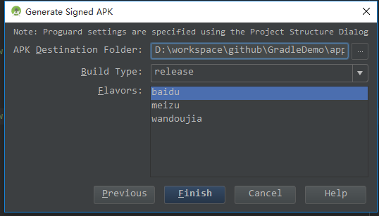
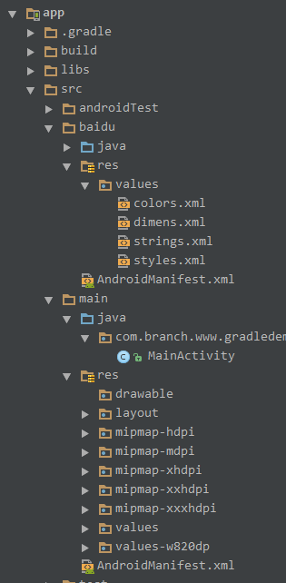
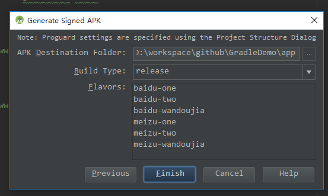
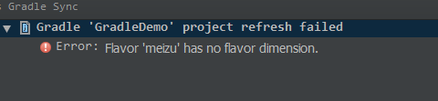
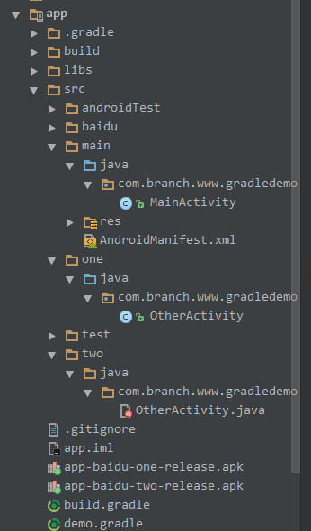
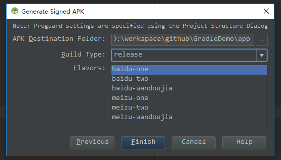

## Gradle Build Files in Android 第三章

### 了解`Build Types` 和 `Flavors`

#### 3.1 了解`Build Types` 

* **debug**和**release**

	Gradle Android 插件提供了两种build类型，**debug**和**release**，他们两者都可以在`buildTypes`节点中配置。例如默认配置：

		buildTypes {
		    release {
		      minifyEnabled false
		      proguardFiles getDefaultProguardFile('proguard-android.txt'), 'proguard-rules.pro'
		    }
		}

	同样可以直接加入`debug`type ，两者配置都可以一样，这是用来区分打包类型。并且debug 默认 debuggable 为true。

* **minifyEnabled，shrinkResources**

	开发很久的项目中通常会存在很多已经不再使用的资源文件，但是人工去删除又比较麻烦，可以使用这两个帮助删除不再使用的资源文件。

		android {
		    buildTypes {
				release {
				minifyEnabled true
				shrinkResources true
				proguardFiles getDefaultProguardFile('proguard-android.txt'),
				  Turn on code shrinking
				'proguard-rules.pro'
				} }
		}

	这两个属性已经要同时设置才能生效。

* **设置后缀的属性**

	为了方便辨别打包后的包是release或debug，可以根据不同的打包类型设置区分。如修改版本名称，修改包名。

		android {
		// ... other properties ... buildTypes {
		        debug {
		            applicationIDsuffix '.debug'
		            versionNameSuffix '-debug'
		}
		// .. other build types ...
		} }

	这样配置后打包的debug包的包名会在后面增加`.debug`，版本名后也会相应的增加`-debug`,这样一个手机上可以很方便安装多个包。

#### 3.2 Flavors and Variants

**问题**

如何做到不同一次build同一个APP不同版本功能的包。

**解决方法**

`productFlavors`用于build不同版本的包，他可能用于免费版，收费版，但是基于代码是一样的，只是有个别属性是不一样的。

例如

	productFlavors {
		    baidu {
		      applicationId 'com.branch.www.gradledemo.baidu'
		    }
		    meizu {
		      applicationId 'com.branch.www.gradledemo.meizu'
		    }
		    wandoujia {
		      applicationId 'com.branch.www.gradledemo.wandoujia'
		}

然后在build apk时可以选择需要的构建

* 每一个构建中可以定义自己的属性，所有的属性基于`defaultConfig`

	* applicationId
	* minSdkVersion
	* targetSdkVersion
	* versionCode
	* versionName
	* signingConfig

* 每一个构建都可以有他自己的`source`和`resource`，如下：

	* app/src/baidu/java
	* app/src/meizu/java
	* app/src/wandoujia/java

	或

	* app/src/baidu/res
	* app/src/meizu/res/layout
	* app/src/wandoujia/res/values

	如：

	

	或 不共用源码

	

* 使用manifestPlaceholders

	同时我们在常用的不同渠道号的apk中有渠道区分或者其他需要在`AndroidManifest.xml`中设置的。

		defaultConfig {
		    applicationId "com.branch.www.gradledemo"
		    minSdkVersion 18
		    targetSdkVersion 24
		    versionCode versionCodes
		    versionName versionNames
		    manifestPlaceholders = [BaiduMobAd_CHANNEL: "common", xxx: "xx"]
		  }

		flavorDimensions 'one', 'two'

		productFlavors {
		    baidu {
		      manifestPlaceholders = [BaiduMobAd_CHANNEL: "baidu", xxx: "xx"]
		      dimension "one"
		//      applicationId 'com.branch.www.gradledemo.baidu'
		    }
		meizu {
		      manifestPlaceholders = [BaiduMobAd_CHANNEL: "meizu", xxx: "xx"]
		      resValue "string", "app_name", "魅族"
		      dimension "one"
		      applicationId 'com.branch.www.gradledemo.meizu'
		    }

	则可以这样使用它

		<meta-data android:name="BaiduMobAd_CHANNEL" android:value="${BaiduMobAd_CHANNEL}" />

* 使用resValue

		meizu {
		    resValue "string", "xxx_name", "魅族"
		    dimension "one"
		    applicationId 'com.branch.www.gradledemo.meizu'
		}

	使用时同样也是R.string.app_xxx_name，跟在`string.xml`中定义是一样的。

#### 3.3 Merging Resources

**问题**

想要根据不同构建设置不懂的text,image等

**解决方法**

参照 3.2 ，每个构建都可以有自己的`source`和`resource`，则可以很方面的设置，这里就不再重复验证。

#### 3.4 Flavor Dimensions 的使用

**问题**

或许 3.2 `Flavors`还不够用，还可以增加，或有太多相同的可以合并。

**解决方法**

使用 ˆflavor dimensions 合并baidu,meizu,wandoujia ,如：

	  flavorDimensions 'one', 'two'

	  productFlavors {
	    baidu {
	      dimension "one"
	//      applicationId 'com.branch.www.gradledemo.baidu'
	    }
	    meizu {
	      dimension "one"
	      applicationId 'com.branch.www.gradledemo.meizu'
	    }
	    wandoujia {
	      dimension "two"
	      applicationId 'com.branch.www.gradledemo.wandoujia'
	    }

	    one {
	      dimension "two"
	    }

	    two {
	      dimension "two"
	    }

然后build是就有2x2+1x2=6个包可以选择。

定义了flavorDimensions后每一个构建都需要加上`dimension`否则报错

与3.2 一样，可以设置属性，同样可以合并相同的。

#### 3.5 Merging Java Sources Across Flavors

**问题**

怎么改变源码或其他java类

**解决方法**

在3.2中创建不同构建对应的文件夹

`resources`可以自动覆盖，并且可以有相同或不相同的而java类有点不一样，java类不能有和main中存在一样的，并且需要从main跳转的在每一个构建中都要存在，但是他们每一个的实现可以不一样。

例如：

可以看到`one`,`two`是组合构建

所以不所有包中都会有一个`OtherActivity`，并且他们的实现方式不一样。
