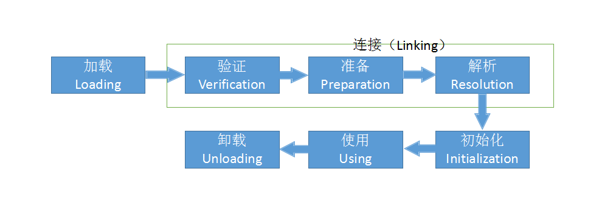
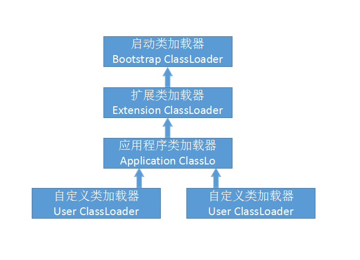

## JAVA 虚拟机 2

## 编译jdk

* [openJDK源码](https://jdk7.java.net/source.html)

### 编译源码需要步骤

#### 构建mac编译环境

* xcode 和Command Line Tool for XCode ,高于当前编译版本的jdk

* 

## 第2章 java 内存区域与内存溢出异常

### 2.1 运行时数据区域

* 程序计数器：一块较小的内存空间，他可以看做当前线程所执行的字节码的行号指示器。在虚拟机的概念模型里，字节码解释器工作时就是通过改变这个计数器的值来选取下一条需要执行的字节码指令，分支，循环，跳转，异常处理，线程恢复等基础功能。

	* 每个线程中都有独立的程序计数器

	* 如果正在执行的是Native方法区，那么当前程序计数值为空。

	* 此内存区域是JAVA唯一一个没有规范任何OutOfMemory情况的区域。

* JAVA虚拟机栈：JAVA方法执行的内存模型，每个方法在执行的同时都会创建一个栈帧用于存储局部变量表，操作数栈，动态链接，方法出口等信息，每一个方法从调用直到执行完成的过程就对应着一个栈帧在虚拟机中入栈到出栈的过程。

	* 线程私有

	* 生命周期与线程一样

	* 局部变量表：各种基本数据类型（boolean，byte，char，short，int，float，long，double），对象引用(refrence类型，它不等于对象本身，而是指向对象起始地址的引用指针，也可能是指向一个代表对象的句柄或其它与此对象相关的位置)和returnAddress类型（指向一条字节码指令的返回地址）

	* 局部变量表所需要的内存区域空间在编译期间完成分配。

	* 会抛出OutOfMemory和StackOverFlowError错误

* 本地方法栈：与虚拟机栈基本一样，唯一不同的是本地方法指的是native方法

* Java堆：是所有线程共享的一块内存区域，此内存唯一的目的是存放对象实例。

	* 虚拟机启动时创建。

	* JAVA虚拟机所管理的内存中最大的一块。

	* 是内存垃圾回收器管理的主要区域。

		* JAVA内存回收采用分代收集算法，所以JAVA堆中还可以细分为，新生代，老年代，在细致一点有Eden空间，From Survivor，to Survivor空间等

	* 内存分配逻辑上连续但物理上不一定连续。

* 方法区：用于存储已被虚拟机加载的类信息，常量，静态变量，及时编译器编译后的代码等数据。

	* 线程共享内存

	* 比较复杂的GC操作

	* 1.7 hotspot 已经把放在永久代的字符串常量移出。

* 运行时常量：Class 文件中除了有类的版本，字段，方法，接口等描述信息外，还有一项信息是常量池，用于存放编译期生成的各种字面量，和符号引用。

	* 

### 2.2 HotSpot 虚拟机对象探秘

* 对象中数据字段的存储位置会因为虚拟机的优化策略而导致不同的内存存储位置。

* 对象大小必须是8的整数位

* 对象访问定位有两种方式

	* 使用句柄池访问，reference指向句柄池汇中有实际对象实例化的地址。

		* 对象地址移动时引用地址不需要改变

	* 直接访问，reference直接指向对象实际地址，也就是reference中必须保留有相关信息。

		* 速度快

### 2.3 OutOfMemoryError 异常

* 如果线程请求的栈深度大于虚拟机所允许的最大深度则会抛出StackOverFlowError，通常递归会增加深度。

* 如果虚拟机在扩展栈是无法申请到足够的内存空间则会抛出OutOfMemoryError

* 每个线程都有都有自己的本地内存，只有在线程本地内存不足时才回去申请更大的内存，这个时候申请内存需要线程同步。

* 本机直接内存溢出。某些限制申请内存的方法在开发中申请内存则会直接无法分配，并且也没有实际向系统申请分配内存而直接抛出内存溢出，并且dump大小也没有实际变化。

## 第3章 垃圾收集器与内存分配

### 3.1 引用计数算法

* 每增加一次引用则引用计数+1，释放一次引用则-1，当对象的引用为0则对象不再被使用可以被清理

* 缺陷是不能处理对象间的循环引用。

### 3.2 可达性分析算法

* 通过一系列的称为“GC Roots”的对象作为起始点，从这个节点开始往下搜索，搜索所有走过的路径（引用链），当一个对象到GC Roots没有任何引用链相连则证明此对象不可用。

* 可以作为GCRoots的对象包括

	* 虚拟机栈中引用的对象

	* 方法区中类静态属性引用的对象。

	* 方法区中常量引用的对象

	* 本地方法栈中JNI引用的对象

* Java引用的类型分类

	* 强引用：默认引用类型，只要引用还在GC就不会回收

	* 软引用：在内存溢出之前GC会清理软引用对象

	* 弱引用：存活时间在下一次GC清理之前

	* 虚引用：形同虚设，不能通过虚引用获取对象，虚引用的唯一作用是在GC清理时告知系统。

* 对象实际清理时机

	* 即使在可达性分析算法中不可达的对象也并没有立即被清理，这个过程至少还需要经历两次标记过程，当第一次可达性分析不可达是需要判断此对象没有必要执行的finalize 方法，

### 3.3 垃圾回收算法

* 标记-清除算法

	* 分成标记和清除两个步骤

	* 标记出所有需要清理的对象，然后清理。

	* 效率不高

	* 内存区域不连续后续很难保证分配大的内存对象

* 复制算法

	* 将内存区域分成两块，每次只使用其中一块，在需要清理时把对象复制到另一块上，然后清理已经使用的内存块。

	* 高效，简单

	* 实际上虚拟机并不会平分，HotSpot将Eden:Survivor 分成8:1 ，但是因为Survivor存在两块，实际上堆能直接使用的是Eden+Survivor：Survivor。

* 标记-整理算法

	* 复制收集算法在对象存活率较高时就要进行较多复制，效率会变的更低，如果不想浪费50%的空间，就需要有额外的空间进行分配担保，所以对于老年区使用标记整理算法。每一次清理内存区域都将会是连续的。

* 分代收集算法

	* 根据对象存活生命周期分成老年代和新生代，根据不同代的特点使用不同算法，老年代生命周期比较长使用标记-清理或标记-整理算法，而对于新生代每次回收比较多所以选择复制算法。

### 3.4 HotSpot的算法实现

* 枚举根节点

	* GC操作为了保证一致性，所以在GC操作时会停止所有Java线程。

	* GC收集时并不会一个一个类的扫描，而是通过OopMap直接获取对象地址

* 安全点

	* HotSpot并没有为每条指令生成对应的OopMap，而是只在特定的位置记录这些信息，这些位置称为安全点（Safepoint）

	* 安全点的选取基于是否程序长时间执行的特征。

	* 安全点：让所有线程执行到安全点暂停的方式有2种

		* 抢占式：不需要线程中代码配置，直接停止所有线程，而没有到达安全点的线程可以执行到安全点再停止

		* 主动式：当需要中断线程时设置标记位，各线程轮训标记位

* 安全区域

	> 如果Thread中出现sleep时GC中断不会等线程重新运行，而是直接设置当前为安全区域，当该线程执行完成后也会判断是否正在GC收集中，如果正在GC收集中则等待GC收集结束信号再往下执行。

### 3.5 垃圾收集器

> 新生代GC算法为复制算法，老年代为标记-整理算法。

* Serilal收集器/Serial Old 收集器

	* 单线程GC收集，必须停止所有其他线程

	* 简单高效

* ParNew收集器/Parallel Old 收集器

	* Serial的多线程版

	* 适用于多CPU

* Parallel Scavenge 收集器

	* 复制算法，多线程

	* 不像其他GC收集器关注用户停顿时间，而是增加吞吐量（CPU用户代码时间/总时间）

* CMS（Concurrent Mark Sweep） 收集器

	* 最短回收停顿时间算法 

	* 标记-清除算法

	* 整个步骤包含以下4步：

		* 初始标记(CMS initial mark)

		* 并发标记(CMS concurrent mark)

		* 重新标记(CMS remark)，修正并发标记中产生的程序运行导致的标记变动

		* 并发清除(CMS concurrent sweep)

	> 初始标记和重新标记需要暂停所有线程。

	* 默认CPU使用数量为（CPU+3）/4

	* 在并发清理过程中产生的垃圾称之为"浮动垃圾"，需要等待下一次才能被清理。

* G1收集器

	* 并行与并发：减少stop the world 时间

	* 分代收集：

	* 控件整合：标记-整理算法

	* 可预测的停顿：指定最大消耗时间片

	* Region概念：将整个Java堆分成多个大小相等的Region。

	* 避免整个堆的扫描，跟踪垃圾堆积的价值大小，在后台维持优先列表，每次回收优先价值最大的region。

	* 使用Remembered Set 记录处于不同Region中的引用，避免出现在不同代中出现的混乱扫描。

	* G1使用步骤

		* 过程中使用Remembered set 记录引用使用情况

		* 初始标记（Inital Marking）

		* 并发标记（Cocurrent Marking）

		* 最终标记（Final Marking）

		* 筛选回收（Live  Data Counting and Evacuation），选择最优的方案清理Region

* 理解GC日志

		33.125:[GC[DefNew:3324K->152K(3712K),0.0025925 secs]3324K->152K(11904K),0.0031680 secs]
		1 0 0.6 6 7:[F u l l G C[T e n u r e d:0 K->2 1 0 K(1 0 2 4 0 K),0.0 1 4 9 1 4 2 s e c s]4603K->210K(19456K),[Perm:2999K->
		2999K(21248K)],0.0150007 secs][Times:user=0.01 sys=0.00,real=0.02 secs]

	> 最前面的数字`33.125：`和`100.667：`代GC发生的时间，这个数字的含义是从Java虚拟机启动以来经过的秒数。

	> GCrizhi开头的`【GC`和`[Full GC]`说明了这次垃圾收集的停顿类型，而不是用来区分新生代GC还是老年代GC的，如果又`Full` 说明这次GC是发生了Stop-The-World的，例如下面这段新生代收集器ParNew的日志也会出现`[Full GC`(这一般是因为出现了分配担保失败之类的问题，所以才导致STW)。如果是调用System.gc()方法所触及的手机，那么在这里将显示`[Full GC（System）`。

			[Full GC 283.736:[ParNew:261599K->261599K(261952K),0.0000288 secs]

	> 接下来的`[DefNew`，`[Tenired`,`[Perm`表示GC发生的区域，这里显示的区域名称与使用的GC收集器是密切相关的，例如上面样例所使用的的Serial收集器中的新生代名为`Default New Generation`,所以显示的是`DefNew `如果是ParNew收集器，新生代的名称就会变成`[ParNew`意为`Parallel New Generation`。如果采用Parallel Scavenge收集器，那他配套的新生代名称为`PSYoungGen`,老年代和永久代同理，名称也是收集器决定的。

	> 后面括号内部的`3324k->152k(3712k)`含义是GC前改内存区域已经使用容量->GC后改内存区域已使用容量（改内存区域总容量）。而在方括号之外的`3324k->(152k11904k)`表示GC前Java堆已经使用容量->GC后Java堆已使用容量(Java堆总容量)。

	> 再往后`0.0025925 secs`表示该内存区域GC所占用的时间，单位是秒。有的收集器会给出更具体的时间数据，如`[Times：user=0.01 sys=0.00,real=0.02 secs]`,这里的user，sys和real与linux的time命令所输出的时间含义一致，分表代表用户消耗的CPU时间，内核消耗CPU时间，和操作从开始到结束所经过的墙钟时间(Wall Clock Time)。CPU时间与墙钟时间的区别是，墙钟时间包括各种非运算等待耗时，例如等待磁盘I/o，等待线程阻塞，而CPU时间不包括这些，但系统有多CPU或者多核的话，多线程操作会叠加这些CPU时间，所以读者看到user或sys时间超过real时间是完全正常的。 
		
### 3.6 内存分配与回收策略

* 对象分配主要在新生代的Eden区上，如果启动本地线程分配则在当前线程的内存上（TLAB）

* 所谓大对象指的是大量连续内存空间的JAVA对象，当Eden中没有可分配的内存，则会直接分配到Old区

* 长期存活的对象将进入老年代

## 第4章 虚拟机性能监控与故障处理工具

### 4.1 JAVA jdk 提供了大量工具

* 主要是在bin目录下的可执行文件

### 4.2 JDK的命令行工具

* jps(JVM Process Status Tool) 列出正在运行的虚拟机进程，并显示虚拟机执行主类名称以及这些进程的本地虚拟机唯一ID。

* jstat:虚拟机统计信息监控工具

* jinfo:Java配置信息工具

* jmap:Java内存映像工具

* jhat:虚拟机堆转储快照分析工具

* jstack:Java堆栈跟踪工具

* HSDIS:jit生成代码反编译

### 4.3 JDK的可视化工具

* JConsole:Java监视与管理控制台

* VisualVM:多合一故障处理工具

	* HotSwap通过不停止HotSpot运行，动态添加调试代码.

## 第5章 调优案例分析与实战

## 第6章 类文件结构

### 6.2 无关性的基石

* 使用字节码格式，一次编译到处运行

### 6.3 Class类文件的结构

* 任何一个Class文件都对应着唯一一个类或接口的定义信息。

* Class文件格式采用一种类似于C语言结构体的伪结构来存储数据，无符号和表。

* 无符号属于基本数据类型，以 u1,u2,u4,u8 代表1个字节，2个字节，4个字节，8个字节。

* 表是由多个无符号或者其他表作为数据项构成的符合数据类型，所有表都习惯以`_info`结尾。

* Class文件格式

	|类型|名称|数量|
	|!------!|!------!|!------!|
	|u4|magic|1|
	|u2|minor_version|1|
	|u2|major_version|1|
	|u2|constant_pool_count|1|
	|cp_info|constant_pool|constant_pool_count-1|
	|u2|access_flags|1|
	|u2|this_class|1|
	|u2|super_class|1|
	|u2|interfaces_count|1|
	|u2|interfaces|interface_count|
	|u2|fields_count|1|
	|field_count|fields|fields_count|
	|u2|methods_count|1|
	|method_info|methods|methods_count|
	|u2|attribute_count|1|
	|attribute_info|attributes|attributes_count|、

	* Class文件的格式被严格控制顺序与占字节数
			
* 魔数与Class文件的版本

	* 每个Class文件的头4个字节称为魔数，他的作用是确定这个文件是否为一个能被虚拟机接受的Class文件。

	* Minor Version次版本号，Major Version主版本号，

		* 不同版本jdk能支持的版本不一样。

	* 可以使用`WinHex`十六进制编辑器查看Class文件

* 常量池
	
	* 常量池大小是不确定的

	* 在constant_pool_count指定常量的数量。

	* 常量池的容量计数从1开始

	常量池主要存放两大类常量

	* 字面量：文本字符串，声明为final的常量值等。

	* 符号引用：

* 访问标记

> 标记是类还是接口，是否定义为public，abstract等

* 类索引，父类索引与接口索引集合

	* 这三项确定类继承关系

* 字段表集合

	* 用于描述接口或者类中声明的变量

* 方法表集合

	* 依次包括访问标记，名称索引，描述索引，属性表集合

* 

### 6.4 字节码指令简介

## 第7章 虚拟机类加载机制

### 7.2 类加载的时机

* 对于类加载Java虚拟机并没有明确强制约束，这点交给虚拟机自由把握，但是虚拟机规范了初始化阶段，有且只有5中情况必须立即对类进行初始化（加载，验证，准备自然需要在之前完成）。

	* 遇到new，getstatic,putstatic或invokestatic这4条字节码指令时，如果类没有初始化，则需要先出发其初始化。生成这4条指令的常见Java场景是：使用new关键字实例化对象的时候，读取或设置一个类的静态字段（被final修饰，已在编译期把结果放入常量池的静态字段除外）的时候，以及调用一个类的静态方法的时候。

	* 使用java.lang.reflect包的方法对类就行反射调用的时候，如果累没有进行初始化，则需要先出发其初始化

	* 当初始化一个类的时候，如果发现其父类还没有进行初始化，则需要先出发其父类的初始化。

	* 当虚拟机启动时，用户需要制定一个要执行的主类方法的那个类，虚拟机先会初始化这个类。

	* 当使用jdk 1.7 的动态语言支持时，如果一个java.lang.invoke,MethodHandle实例最后的解析结果REF_getstatic,REF_putStatic,REF_invokeStatic的方法句柄，并且这个句柄所对应的类没有进行初始化，需要先触发初始化。

### 7.3 类加载的过程

##### 1. 加载

加载阶段虚拟机完成以下3件事

1. 通过一个类的全限定名来获取定义此类的二进制字节流。

2. 将这个字节流所代表的静态存储结构转化为方法区的运行时结构数据。

3. 在内存中生成一个代码这个类的java.lang.Class对象，作为方法区这个类的各种数据的访问入口。

##### 2. 验证

确保Class文件符合Java 虚拟机要求，验证阶段分4个阶段。

1. 文件格式验证

	第一阶段要验证字节流是否符合Class文件格式的规范，并且能被当前版本的虚拟机处理，第一阶段可能包括下面这些验证点。

	* 是否以魔数0xCAFEBABE开头

	* 主，次版本是否在当前虚拟机处理范围内。

	* 常量池的常量中是否有不被支持的常量类型（检查常量tag标志）。

	* 指向常量的各种索引值中是否有指向不存在的常量和不符合类型的常量。

	* CONSTANT_Utf8_info型的常量中是否有不符合UTF8编码的数据。

	* Class文件中各个部分及文件本身是否被删除的或附加的其他信息。

	...

2. 元数据验证

	进行字节码信息语义分析，保证其描述信息符合Java语言规范

	* 这个类是否有父类

	* 这个类的父类是否继承了不允许继承的类

	* 如果这个类不是抽象类，是否实现了父类或接口之中要求实现的所有方法。

	* 类中的字段，方法是否与父类产生矛盾（例如覆盖了父类final字段，或者出现了不符合规则的方法重载）

3. 字节码验证

	最复杂阶段，主要目的是通过数据流和控制流分析，确定程序语义是合法的，符合逻辑的。

	* 保证任何时候操作数栈的数据类型与指令代码序列都能配合工作，例如不会出现类似这样的情况：在操作栈放置一个int类型的数据，使用时却按long类型来加载入本地变量表中。

	* 保证跳转指令不会跳转到方法体意外的字节码指令上。

	* 保证方法体中的类型转换是有效的，例如可以把一个子类对象赋值给父类数据类型，这个是安全的，但是把父类对象赋值给子类数据类型，甚至把对象赋值给与它毫无继承关系，完全不相干到的一个数据类型，则是微信和不合法的。

	如果一个类方法体的字节码没有通过字节码验证那肯定是有问题的，但如果一个方法体过了字节码验证，也不能说明其一定就是安全的。

4. 符号引用验证

	最后阶段的校验，在解析阶段发生。

	* 符合引用中通过字符串描述的全限定名是否能找到对应的类。

	* 在指定类中是否存在符合方法的字段描述符以及简单名称锁描述的字段和方法。

	* 符合引用中的类，字段，方法的访问性是否可以被当前类访问。

##### 3. 准备

准备阶段是正式为类变量分配内存并设置类变量初始值的阶段。

##### 4. 解析

解析阶段是虚拟机将常量池内的符号引用替换为直接引用的过程。

##### 5. 初始化

类初始化是类加载过程的最后一步。

### 7.4 类加载器

##### 双亲委派模型

* 3种类加载器

1. 启动类加载器（Bootstrap ClassLoader）

	这个类加载器负者将放在<JAVA_HOME>\lib 目录中的，或者被-Xbootclasspath参数所指定路径中，并且是虚拟机识别的（仅按照文件名识别，如rt.jar，名字不符合的类库即使放在lib目录中也不会被加载）

2. 扩展类加载器（Extension ClassLoader）

	这个类加载器有sun.misc.Launcher$ExtClassLoader实现，它负责加载<JAVA_HOME>\lib\ext目录中的，或者被Java.ext.dirs系统变量锁指定的路径中的所有类库，可以者可以直接使用扩展类加载器。

3. 应用程序类加载器（Application ClassLoader）

	这个类加载有sun.misc.Launcher$AppClassLoader实现。由于这个类加载器是ClassLoader中的getSystemClassLoader()方法的返回值，所以一般称他为系统类加载器，他负责加载用户类路径（ClassPath）上所指定的类库

* 类加载器层次关系

展示中的类加载器之间的这种层次关系，称为类加载器的双亲委托模型。双亲微泡模型要求除了顶层的启动类加载器外，其余的类加载器都应当有自己的父类加载器。这里类加载器之间的父子关系一般不会以继承的关系来实现，而是都使用组合关系来复用父加载器的代码。

双亲委派模型的工作过程是：如果一个类加载器收到类加载的请求，他首先不会自己去尝试加载这个类，而是把这个请求委派给父类加载器去完成，每一个层次的类加载器都是如此，因此所有的加载请求最终都应该传送到顶层的启动类加载器中，只有当父加载器返回自己无法完成这个加载请求时，子加载器才会尝试自己去加载。

##### 破坏双亲委派模型

* 向前兼容

* 设计缺陷（基类需要调用用户代码）

* 追求动态性，代码热替换，模块热部署

## 第8章 虚拟机字节码执行引擎

### 8.2 运行时栈帧结构

* 用于支持虚拟机进行方法调用和方法执行的数据结构，他是虚拟机运行时数据区中的虚拟机栈的栈元数。

* 栈帧结构存储了方法的局部变量表，操作数栈，动态连接和方法返回地址等信息。

* 局部变量栈

    * 局部变量栈是一组变量值存储空间，用户存放方法参数和方法内部定义的局部变量，局部变量以变量槽（Variable Slot）为最小单位。 

	* 不使用的对象设置为null可以加快内存清理

	* 

* 操作数栈

	* 他是一个后入先出栈，指令过程中的进栈出栈

* 动态连接

	* 每一个栈帧都包含一个指向运行时常量池中改栈帧所属方法的引用，持有这个引用是为了支持方法调用过程中的动态连接。

* 方法返回地址

	* 方法执行时需要记录执行点，等到方法执行返回后要回到调用的位置。

### 方法调用

