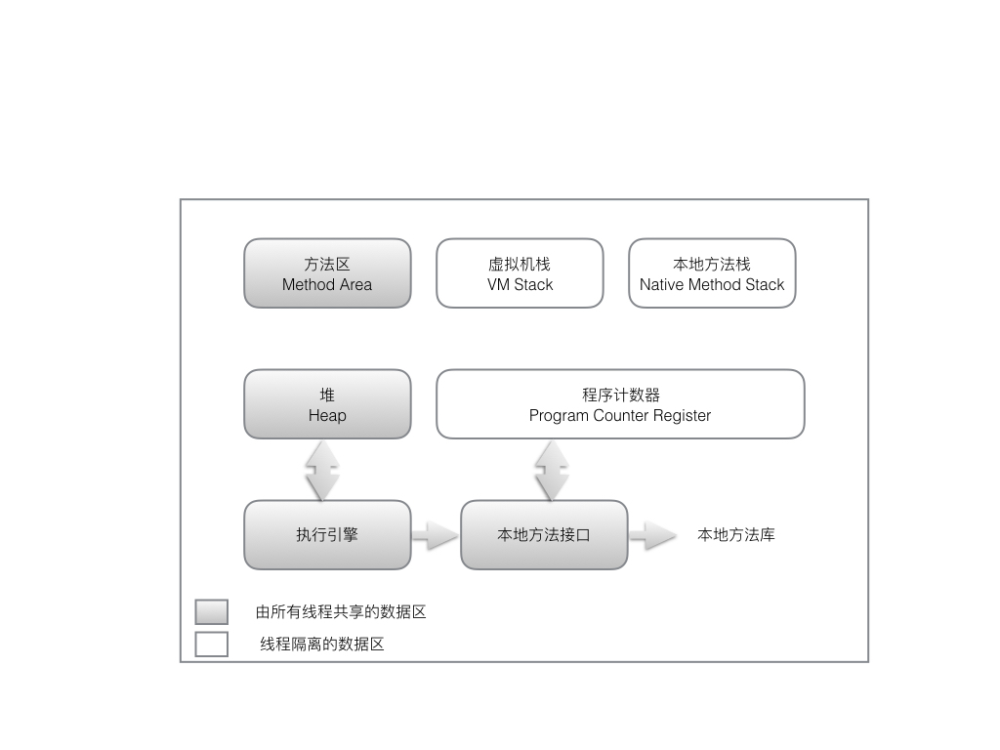

## JAVA 虚拟机 2

## 编译jdk

* [openJDK源码](https://jdk7.java.net/source.html)

### 编译源码需要步骤

#### 构建mac编译环境

* xcode 和Command Line Tool for XCode ,高于当前编译版本的jdk

* 

## 第2章 java 内存区域与内存溢出异常

### 2.1 运行时数据区域

* 程序计数器：一块较小的内存空间，他可以看做当前线程所执行的字节码的行号指示器。在虚拟机的概念模型里，字节码解释器工作时就是通过改变这个计数器的值来选取下一条需要执行的字节码指令，分支，循环，跳转，异常处理，线程恢复等基础功能。

	* 每个线程中都有独立的程序计数器

	* 如果正在执行的是Native方法区，那么当前程序计数值为空。

	* 此内存区域是JAVA唯一一个没有规范任何OutOfMemory情况的区域。

* JAVA虚拟机栈：JAVA方法执行的内存模型，每个方法在执行的同时都会创建一个栈帧用于存储局部变量表，操作数栈，动态链接，方法出口等信息，每一个方法从调用直到执行完成的过程就对应着一个栈帧在虚拟机中入栈到出栈的过程。

	* 线程私有

	* 生命周期与线程一样

	* 局部变量表：各种基本数据类型（boolean，byte，char，short，int，float，long，double），对象引用(refrence类型，它不等于对象本身，而是指向对象起始地址的引用指针，也可能是指向一个代表对象的句柄或其它与此对象相关的位置)和returnAddress类型（指向一条字节码指令的返回地址）

	* 局部变量表锁需要的内存区域空间在编译期间完成分配。

	* 会抛出OutOfMemory和StackOverFlowError错误

* 本地方法栈：与虚拟机栈基本一样，唯一不同的是本地方法指的是native方法

* Java堆：是所有线程共享的一块内存区域，此内存唯一的目的是存放对象实例。

	* 虚拟机启动时创建。

	* JAVA虚拟机所管理的内存中最大的一块。

	* 是内存垃圾回收器管理的主要区域。

		* JAVA内存回收采用分代收集算法，所以JAVA堆中还可以细分为，新生代，老年代，在细致一点油Eden空间，From Survivor，to Survivor空间等

	* 内存分配逻辑上连续但物理上不一定连续。

* 方法区：用于存储已被虚拟机加载的类信息，常量，静态变量，及时编译器编译后的代码等数据。

	* 线程共享内存

	* 比较复杂的GC操作

	* 1.7 hotspot 已经把放在永久代的字符串常量移出。

* 运行时常量：Class 文件中除了有类的版本，字段，方法，接口等描述信息外，还有一项信息是常量池，用于存放编译期生成的各种字面量，和符号引用。

	* 

### 2.2 HotSpot 虚拟机对象探秘

* 对象中数据字段的存储位置会因为虚拟机的优化策略而导致不同的内存存储位置。

* 对象大小必须是8的整数位

* 对象访问定位有两种方式

	* 使用句柄池访问，reference指向句柄池汇中有实际对象实例化的地址。

		* 对象地址移动时引用地址不需要改变

	* 直接访问，reference直接指向对象实际地址，也就是reference中必须保留有相关信息。

		* 速度快

### 2.3 OutOfMemoryError 异常

* 如果线程请求的栈深度大于虚拟机所允许的最大深度则会抛出StackOverFlowError，通常递归会增加深度。

* 如果虚拟机在扩展栈是无法申请到足够的内存空间则会抛出OutOfMemoryError

* 每个线程都有都有自己的本地内存，只有在线程本地内存不足时才回去申请更大的内存，这个时候申请内存需要线程同步。

* 本机直接内存溢出。某些限制申请内存的方法在开发中申请内存则会直接无法分配，并且也没有实际向系统申请分配内存而直接抛出内存溢出，并且dump大小也没有实际变化。

## 第3章 垃圾收集器与内存分配

### 3.1 引用计数算法

* 每增加一次引用则引用计数+1，释放一次引用则-1，当对象的引用为0则对象不再被使用可以被清理

* 缺陷是不能处理对象间的循环引用。

### 3.2 可达性分析算法

* 通过一系列的称为“GC Roots”的对象作为起始点，从这个节点开始往下搜索，搜索所有走过的路径（引用链），当一个对象到GC Roots没有任何引用链相连则证明此对象不可用。

* 可以作为GCRoots的对象包括

	* 虚拟机栈中引用的对象

	* 方法区中类静态属性引用的对象。

	* 方法区中常量引用的对象

	* 本地方法栈中JNI引用的对象

* Java引用的类型分类

	* 强引用：默认引用类型，只要引用还在GC就不会回收

	* 软引用：在内存溢出之前GC会清理软引用对象

	* 弱引用：存活时间在下一次GC清理之前

	* 虚引用：形同虚设，不能通过虚引用获取对象，虚引用的唯一作用是在GC清理时告知系统。

* 对象实际清理时机

	* 即使在可达性分析算法中不可达的对象也并没有立即被清理，这个过程至少还需要经历两次标记过程，当第一次可达性分析不可达是需要判断此对象没有必要执行的finalize 方法，

### 3.3 垃圾回收算法

* 标记-清除算法

	* 分成标记和清除两个步骤

	* 标记出所有需要清理的对象，然后清理。

	* 效率不高

	* 内存区域不连续后续很难保证分配大的内存对象

* 复制算法

	* 将内存区域分成两块，每次只使用其中一块，在需要清理时把对象复制到另一块上，然后清理已经使用的内存块。

	* 高效，简单

	* 实际上虚拟机并不会平分，HotSpot将Eden:Survivor 分成8:1 

* 标记-整理算法

	* 复制手机算法在对象存活率较高时就要进行较多复制，效率会变的更低，如果不想浪费50%的空间，就需要有额外的空间进行分配担保，所以对于老年区使用标记整理算法。每一次清理内存区域都将会是连续的。

* 分代收集算法

	* 根据对象存活生命周期分成老年代和新生代，根据不同代的特点使用不同算法，老年代生命周期比较长使用标记-清理或标记-整理算法，而对于新生代每次回收比较多所以选择复制算法。

### 3.4 HotSpot的算法实现

* 枚举根节点

	* GC操作为了保证一致性，所以在GC操作时会停止所有Java线程。

	* GC收集时并不会一个一个类的扫描，而是通过OopMap直接获取对象地址

* 安全点

	* HotSpot并没有为每条指令生成对应的OopMap，而是只在特定的位置记录这些信息，这些位置称为安全点（Safepoint）

	* 安全点的选取基于是否程序长时间执行的特征。

	* 安全点：让所有线程执行到安全点暂停的方式有2种

		* 抢占式：不需要线程中代码配置，直接停止所有线程，而没有到达安全点的线程可以执行到安全点再停止

		* 主动式：当需要中断线程时设置标记位，各线程轮训标记位

* 安全区域

* 如果Thread中出现sleep是GC中断不会等线程重新运行，而是直接设置当前为当前为安全区域，当该线程执行完成后也会判断是否正在GC收集中，如果正在GC收集中则等待GC收集结束信号。

### 3.5 垃圾收集器

> 新生代GC算法为复制算法，老年代为标记-整理算法。

* Serilal收集器/Serial Old 收集器

	* 单线程GC收集，必须停止所有其他线程

	* 简单高效

* ParNew收集器/Parallel Old 收集器

	* Serial的多线程版

	* 适用于多CPU

* Parallel Scavenge 收集器

	* 复制算法，多线程

	* 不像其他GC收集器关注用户停顿时间，而是增加吞吐量（CPU用户代码时间/总时间）

* CMS（Concurrent Mark Sweep） 收集器

	* 最短回收停顿时间算法 

	* 标记-清除算法

	* 整个步骤包含以下4步：

		* 初始标记(CMS initial mark)

		* 并发标记(CMS concurrent mark)

		* 重新标记(CMS remark)，修正并发标记中产生的程序运行导致的标记变动

		* 并发清除(CMS concurrent sweep)

		> 初始标记和重新标记需要暂停所有线程。

		* 默认CPU使用数量为（CPU+3）/4

		* 在并发清理过程中产生的垃圾称之为浮动垃圾，需要等待下一次才能被清理。

* G1收集器

	* 