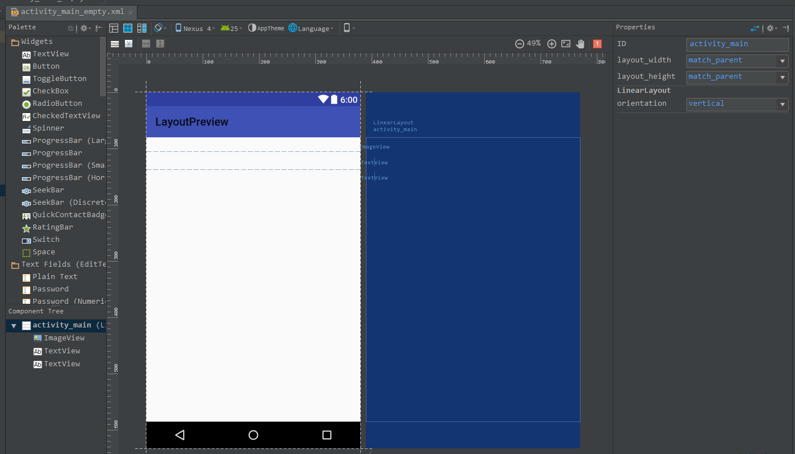
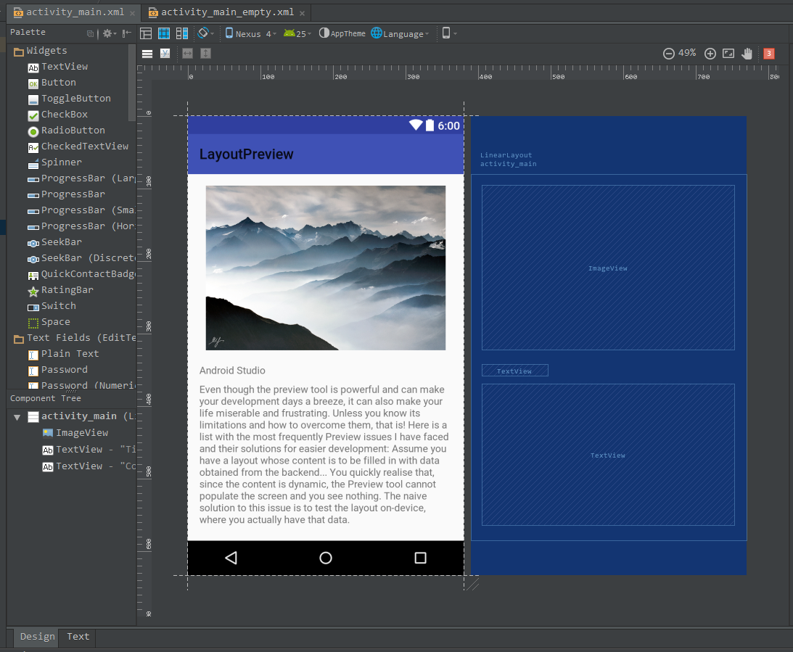
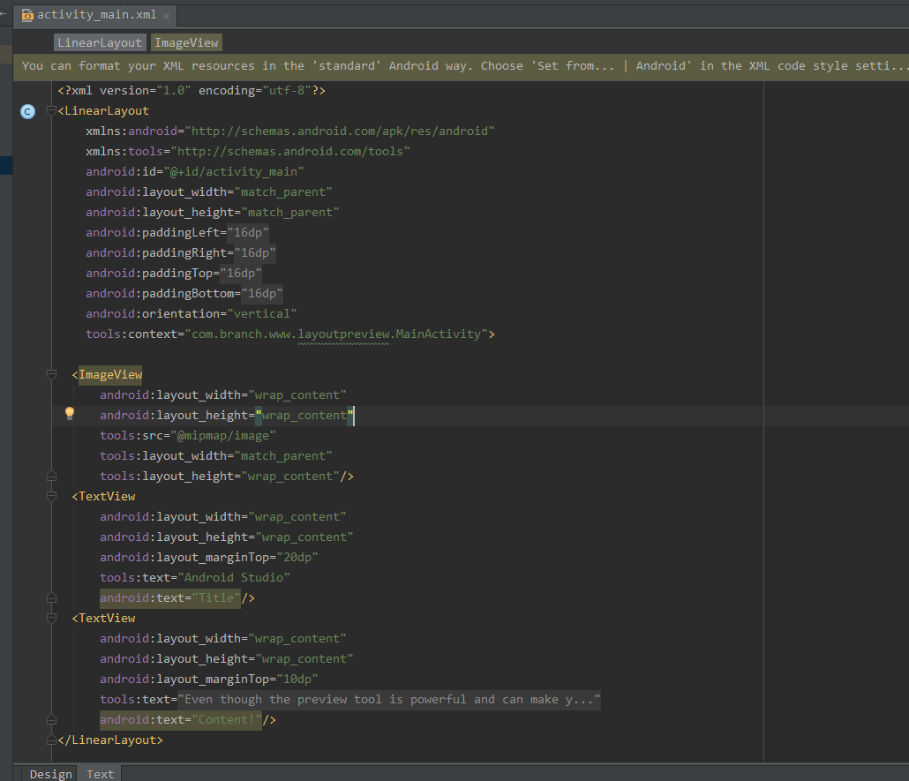
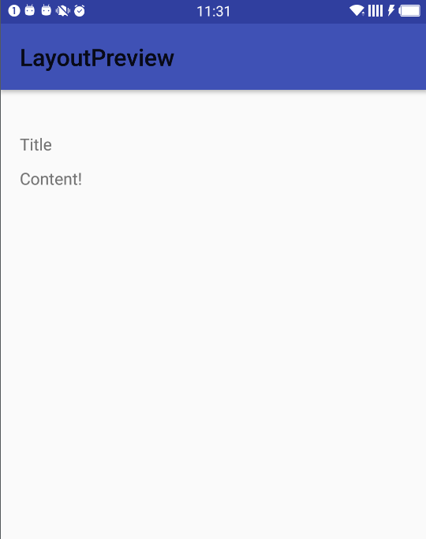
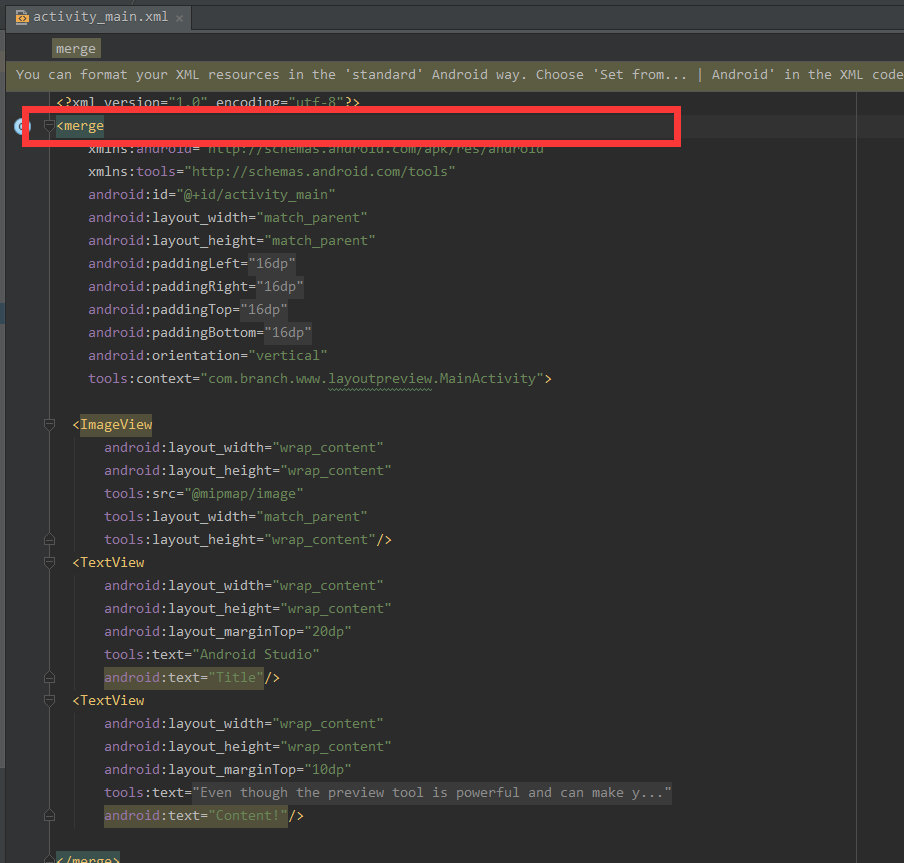
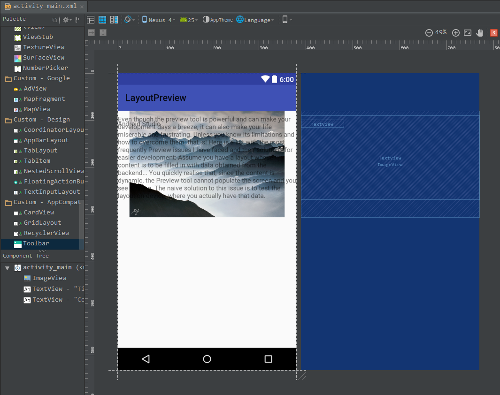
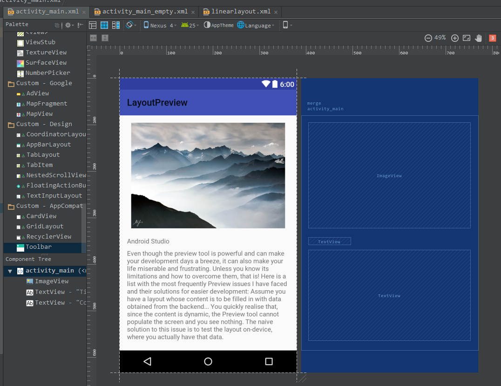

#### Android Studio Layout PreView

> 开发中我们频繁使用Layout Preview ,但是发现还有很多没有利用起来，导致有很多使用上的问题，例如开发过程中不能所以设置的一些String ,Src 等属性，也就导致通常页面一片空白，merge导致布局是混乱的等，那么怎么高效使用呢，解决下面几个问题就能高效使用了：

> * [开始设置](#start)

> * [从页面空白到随意测试页面](#empty_layout)

> * [更加详细请看官方文档](#more)

##### 1. 加上`tools`命名空间<a name="start">

	<RootTag xmlns:android="http://schemas.android.com/apk/res/android"
	    xmlns:tools="http://schemas.android.com/tools" >

##### 2. 从页面空白到随意测试页面<a name="empty_layout"/>

> 这一点在看别人代码时最常遇见，点开它的布局文件想要第一时间知道大致的布局我们都会点到design,理想状态是能立马看到布局，但是结果往往是这样的：

> 结果就是你还是得花时间看代码。因为通常我们正式代码中也不建议在控件设置各种值，但是我们在开发中又希望看到，所以看下面改进版。

###### 改进版如下：

> xml 如下 

> ###### 实际效果

> 当我们运行时发现实际效果其实完全没有改变，也就是`tools`只用在编辑模式中，并不会build 到APP中，这正是我们需要的。

##### 动态改变控件

> 有了上面的经验后就知道想要测试则使用`tools`，那么例如TextView，ImageView，ListView等等，所有他们的属性都可以通过`tools`来测试。

##### `<merge> layout` 不能渲染问题

> 为了减少布局层级，是很有必要使用`merge`，但是使用之后我们也遇到渲染时不方便查看的问题，那么怎么解决呢？使用`tools:parentTag="LinearLayout"`吧。

###### 使用之前：

> 导致的结果是不能直观查看效果

###### 使用tools之后：

> 非常方便的查看效果，并且不会影响正式版
> `tools:parentTag="xx"` 可以设置所有的系统控件，`LinearLayout`,`FrameLayout`,`ReleativeLayout`

##### 3.更加详细请看官方文档<a name="more"/>

[官方文档说明](https://developer.android.com/studio/write/tool-attributes.html)

还有关于layout,showin,shrinking 等相关配置。