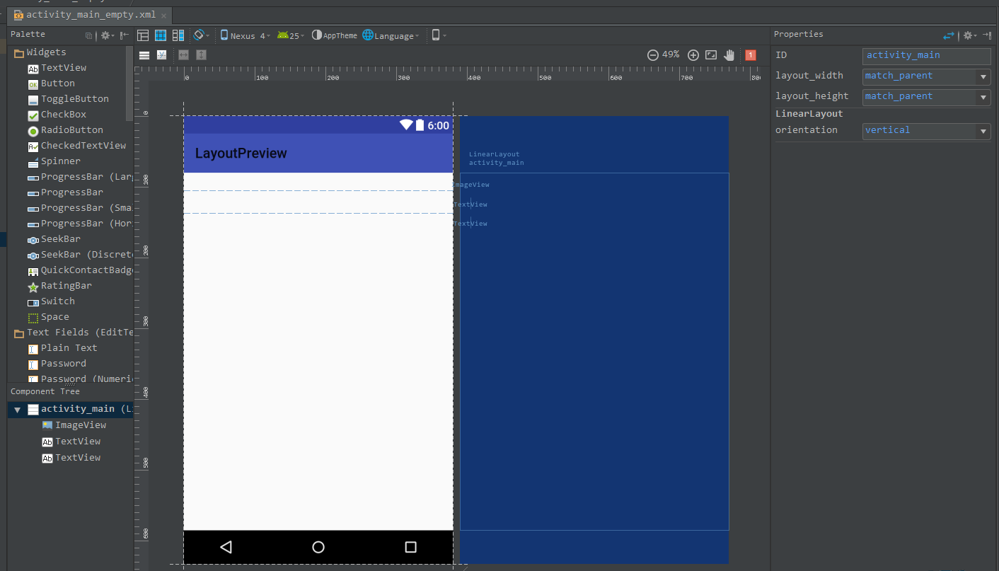
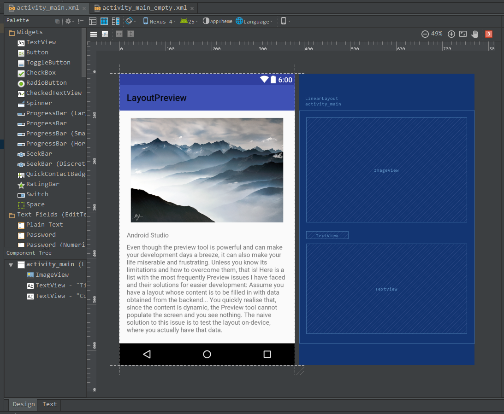
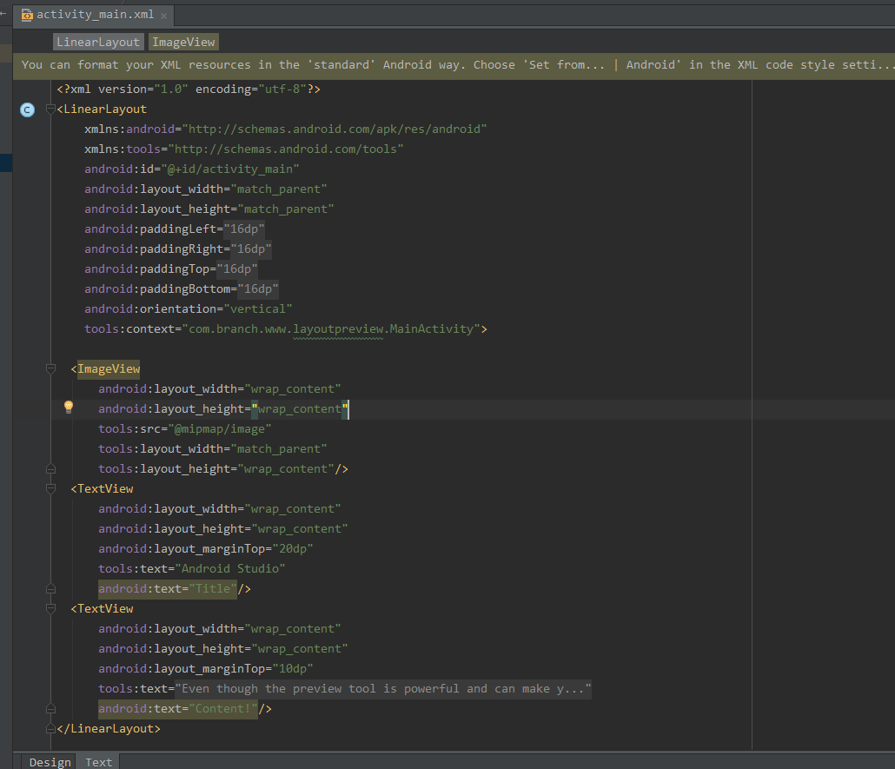
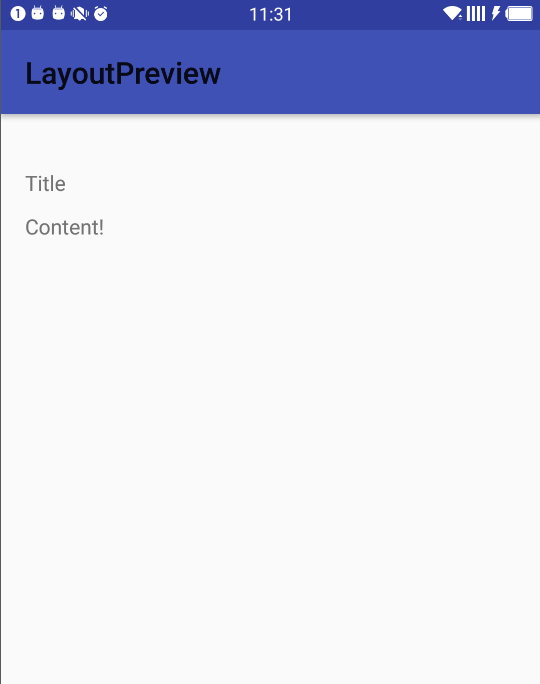
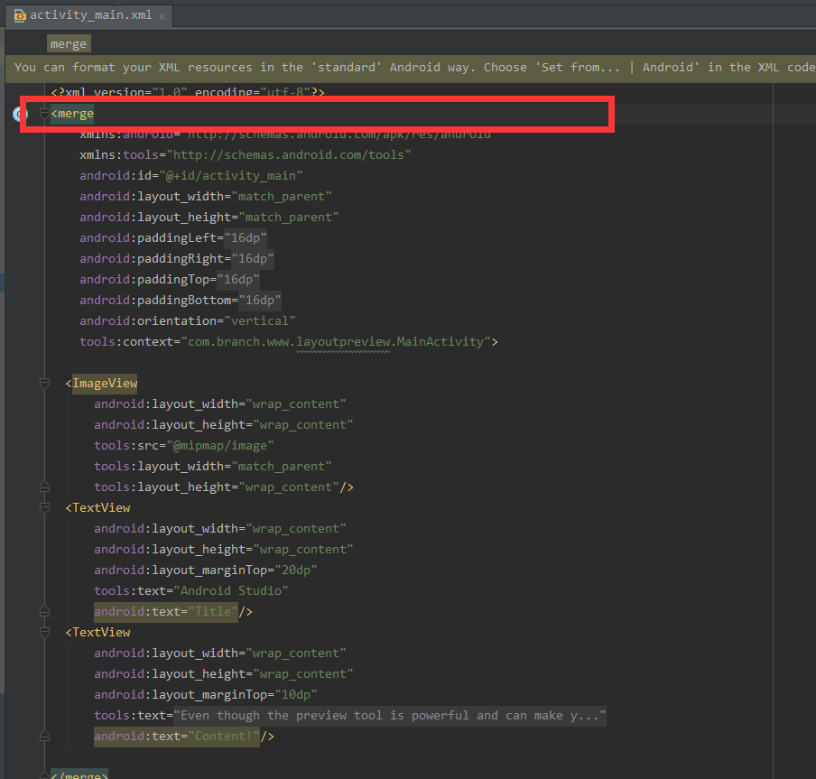
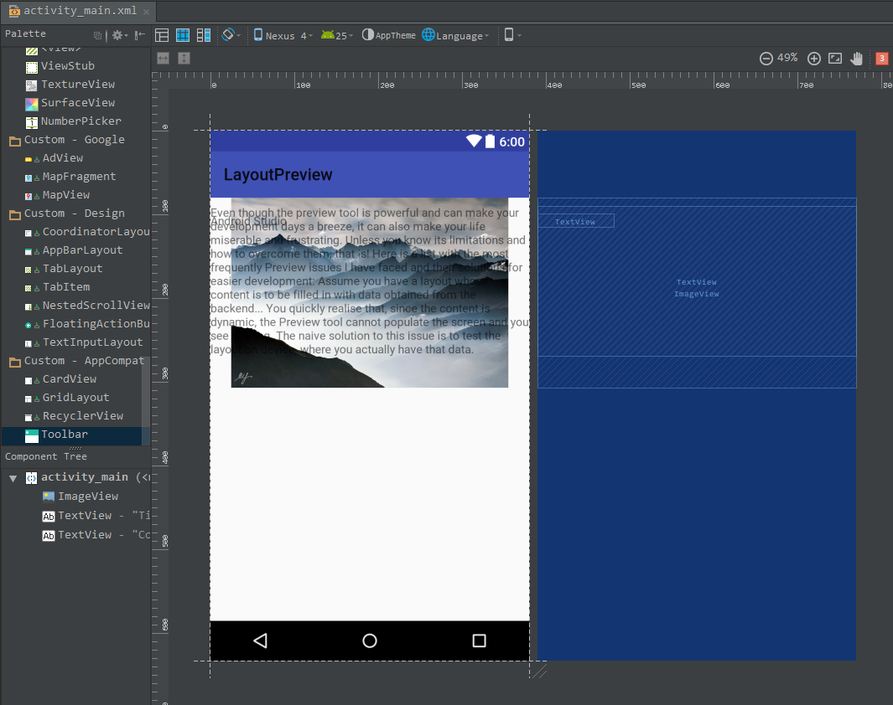
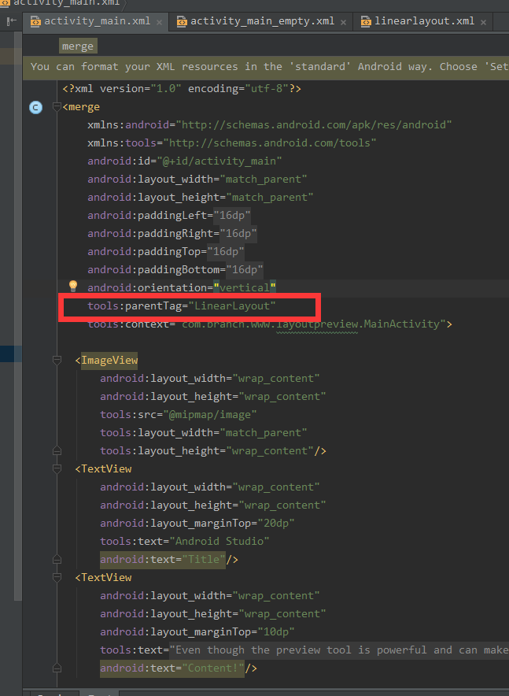
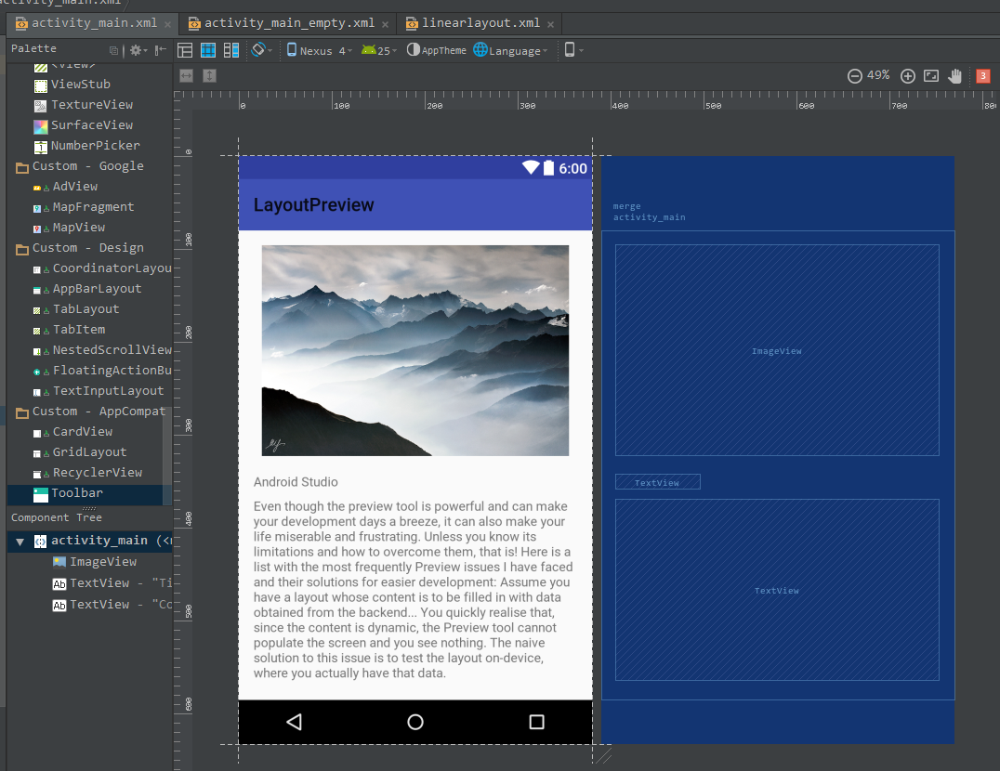

#### Android Studio Layout PreView

> 开发中我们频繁使用Layout Preview ,但是发现还有很多没有利用起来，导致使用上有很多问题，例如我们开发过程中设置的一些String ,Src 不能保证提交前一定删除干净了，然而删除赶紧了对下一次开发又不方便，那么怎么高效使用呢，解决下面几个问题就能高效使用了：

> * 页面看上去一片空白

> * 动态改变控件

> * 自定义控件预览报错问题

> * `<merge> layout` 不能渲染问题

##### 1. 页面看起来一片空白

> 这一点在看别人代码时最常遇见，点开它的布局文件想要第一时间知道大致的布局我们都会点到design,理想状态是能立马看到布局，但是结果往往是这样的：

> 结果就是你还是得花时间看代码。因为通常我们正式代码中也不建议在控件设置各种值，但是我们在开发中又希望看到，那么应该怎么解决呢？使用`tools`吧，在root控件中引入`xmlns:tools="http://schemas.android.com/tools"`。

> ###### 改进版如下：

> xml 如下 

> ###### 实际效果

> 当我们运行时发现实际效果其实完全没有改变，也就是`tools`只用在编辑模式中，并不会build 到APP中，这正是我们需要的。

##### 2. 动态改变控件

> 有了上面的经验后就知道想要测试则使用`tools`，那么例如TextView，ImageView，ListView等等，所有他们的属性都可以通过tools测试。

##### 3. 自定义控件预览报错问题

> 

##### 4. `<merge> layout` 不能渲染问题

> 为了减少布局层级，是很有必要使用`merge`，但是使用之后我们也遇到渲染时不方便查看的问题，那么怎么解决呢？使用`tools:parentTag="LinearLayout"`吧。

###### 之前：

> 导致的结果是不能直观查看效果

###### 使用tools之后：

> 非常方便的查看效果，并且不会影响正式版
> `tools:parentTag="xx"` 可以设置所有的系统控件，`LinearLayout`,`FrameLayout`,`ReleativeLayout`

##### 5.更加详细请看官方文档

